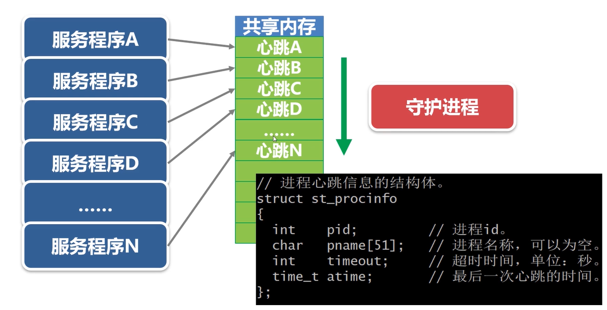
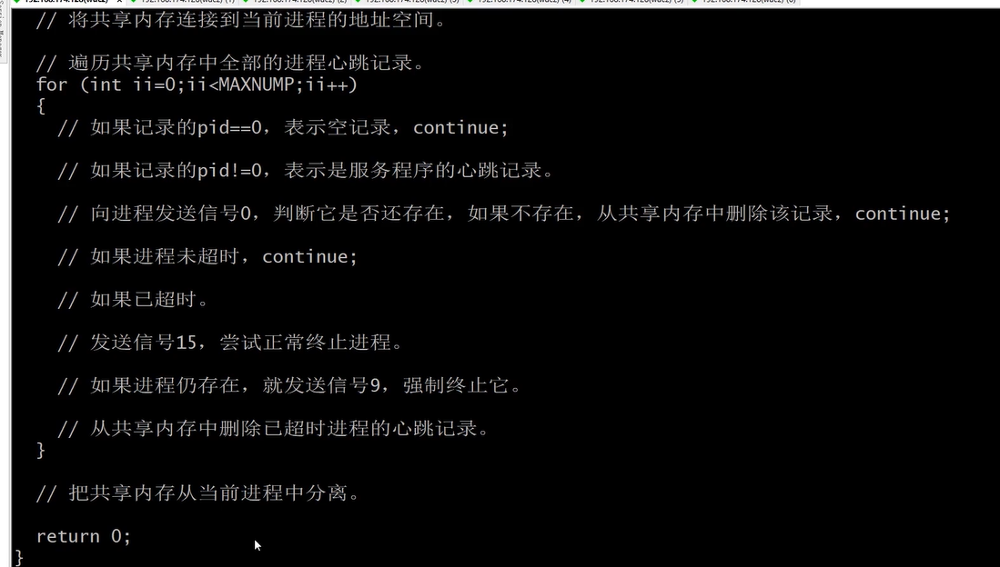
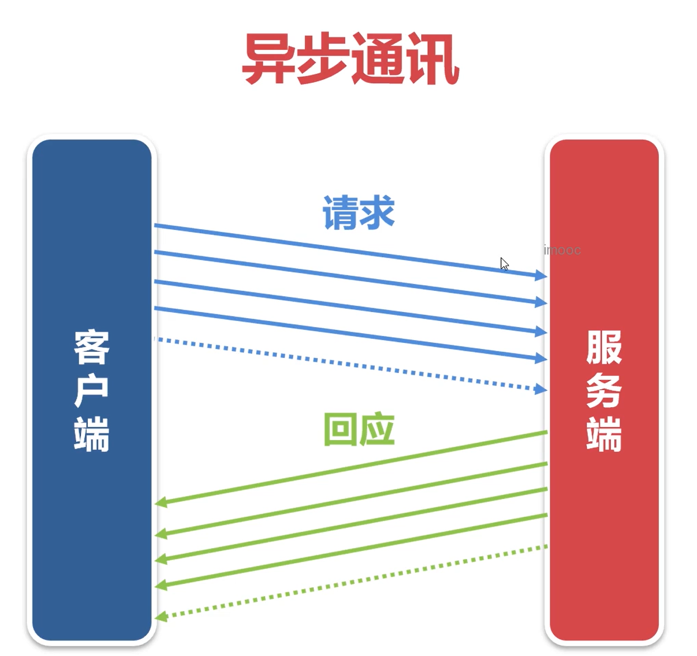
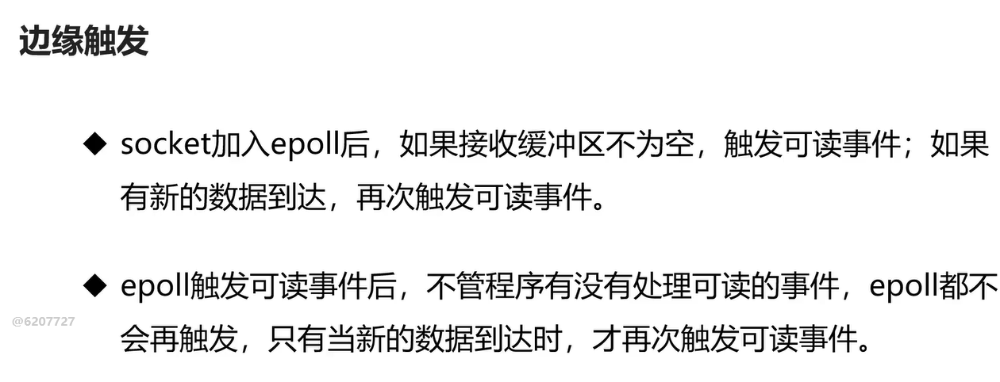
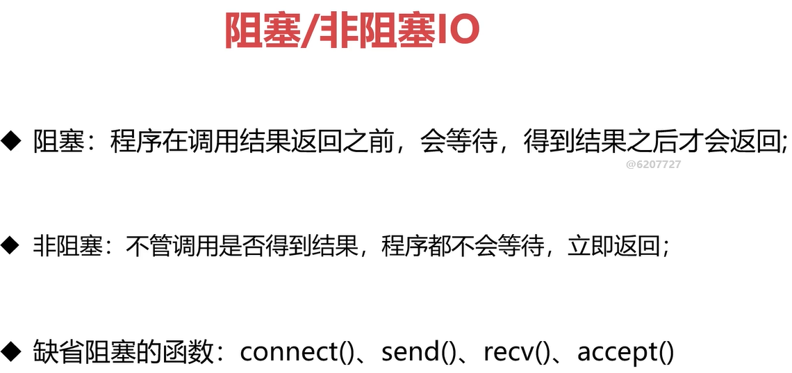
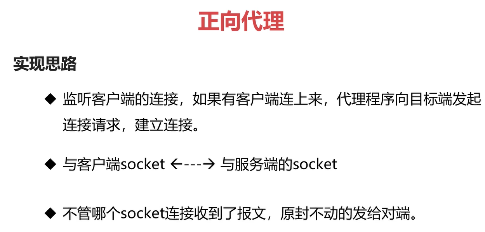

项目

[TOC]

## 项目介绍

项目依托气象行业数据（数据总量大，且每天新增数据量大），模拟气象数据中心

该项目从数据源采集数据后存储到多个数据库中；业务系统通过数据库集群的总线访问数据

数据源：卫星接收站、雷达系统、国家基本站、区域气象站

业务系统：预警发布系统、预报制作系统、公共服务平台、数据共享平台

数据采集->数据处理->数据入库（数据库集群）->数据服务总线

主要功能子系统为：

**1.数据采集子系统**

功能：把数据从数据源取出

三个模块：（1）ftp客户端，直接下载数据文件；（2）http客户端，采用http协议，从WEB服务接口数据；（3）直连数据库的数据源，从表中抽取数据

**2.数据处理和加工子系统**

功能：把各种格式的原始数据解码为xml格式的数据文件；对原始数据进行二次加工生成高可用的数据集。

**3.数据入库子系统**

功能：把数百种数据存储到数据中心的表中

**4.数据同步子系统**

MySQL的高可用方案只能解决部分问题，且不够灵活，效率不高（只能满足数据库之间的复制不能满足表之间的复制）。本项目把核心数据库(Slave)表中的数据按条件和数据增量两种方式同步到业务数据库中。

项目数据库主要分为两种Master和Slave。

业务数据库主要由业务的需求决定（历史库（量大效率低）， 实时库（量小效率高）， 预报库， 台风库（量小效率高）， 接口库）

**5.数据管理子系统**

功能：清理历史数据；把历史数据备份和归档

**6.数据交换子系统**

功能：把数据中心的数据从表中导出来生成数据文件。采用ftp协议，把数据文件推送到对方的ftp服务器。基于tcp协议的快速传输文件子系统

**7.数据服务总线子系统**

功能：用C++开发WEB服务，为业务提供数据访问接口，使用数据库连接池、线程池效率极高

**8.网络代理服务子系统**

功能：用于运维，利用I/O复用技术(select/poll/epoll)

**项目重点和难点：**（1）服务程序的稳定性；（2）数据处理和服务的效率；（3）功能模块的通用性

## 开发环境

CentOS7.x	MySQL5.7	字符集utf-8

## 项目框架

 

.png)

## 服务程序常驻后台

保持服务程序稳定性，用守护进程监控服务程序的运行状态，如果服务程序故障，调度进程会重启服务程序

### 服务程序的调度

利用linux信号和多进程

先执行fork函数，创建一个子进程，让子进程调用execl执行新的程序

新程序将替换子进程，不会影响父进程

 在父进程中，可以调用wait函数等待新程序运行的结果，这样就可以实现调度的功能

### 守护进程的实现

利用linux共享内存和linux信号量

// 查看共享内存：  ipcs -m   删除共享内存：  ipcrm -m shmid

// 查看信号量：    ipcs -s  删除信号量：    ipcrm sem semid

**信号量CSEM m_sem;** 

m_semid=semget(key,1,0666)

如果errno==2表示信号量不存在， 创建m_semid=**semget**(key,1,0666|IPC_CREAT|IPC_EXCL)

// 信号量创建成功后，还需要把它初始化成value。

union semun sem_union;		sem_union.val = value;   // 设置信号量的初始**semctl**(m_semid,0,SETVAL,sem_union)

// **加锁** CSEM::P 调用：

**semop**(m_semid,&sem_b,1)   其中：struct **sembuf** sem_b;    sem_b.sem_num = 0; sem_b.sem_op = -1; sem_b.sem_flg = m_sem_flg;

**共享内存**

**创建/获取**共享内存，键值为SHMKEYP，大小为MAXNUMP个st_procinfo结构体的大小。

**shmget**：m_shmid = shmget((key_t)SHMKEYP, MAXNUMP*sizeof(struct st_procinfo), 0666|IPC_CREAT)

将共享内存**链接**到当前进程的地址空间。

**shmat**： m_shm=(struct st_procinfo *)shmat(m_shmid, 0, 0);

把共享内存从当前进程中**分离**。

**shmdt** ：shmdt(m_shm)

## 数据采集子系统&数据交换子系统

### ftp客户端下载模块

模块功能：已知服务器的文件路径名和保存到本地的文件路径名，**把服务器上某个目录的文件全部下载到本地目录**（可以指定文件名匹配规则）。文件下载成功后，ptype==1，服务器啥都不做，ptype==2，服务器删除文件，ptype==3，服务器备份文件

模块位置：/project/tools1/c/ftpgetfiles.cpp

模块实现：

1. 基于Cftp类，头文件在/project/public/_ftp.h中

   结构体st_fileinfo中包含文件名filename，文件时间mtime

   容器vlistfile2存放服务器待下载文件信息；容器vlistfile1存放已经传输完成的文件信息；

   容器vlistfile3存放本地以及下载的但服务器中还有的文件；容器vlistfile4存放服务器中新增文件

   listfilename中存放服务器文件；okfilename中存放已经传输完成的文件；strremotefilenamebak备份目录

2. 输入参数写成xml格式方便应对众多输入参数。利用**GetXMLBuffer**函数读取输入参数

3. 创建心跳信息：**CPActive**类中的**AddPInfo**(starg.timeout, starg.pname)函数

4. 登录ftp服务器：**ftp.login**(starg.host, starg.username, starg.password, starg.mode)

5. 进入ftp服务器存放文件的目录**ftp.chdir**(starg.remotepath)，（调用FtpChdir）

6. 调用**ftp.nlist()**方法列出服务器目录中的文件，结果存放到本地文件listfilename中：

   ftp.nlist(".", starg.listfilename)，其中有MKDIR()和FtpNlst(listfilename,remotedir,m_ftpconn)

7. LoadListFile加载文件函数，将上述ftp.nlist()方法获取到的list文件加载到容器vlistfile2中（1）打开本地文件File.Open（listfilename）（2）读取本地文件中的一行到File.Fgets（3）MatchStr匹配满足条件的文件（4）当ptype为1，checktime为true时，调用ftp.mtime（底层调用FtpModDate函数）获取ftp服务器文件时间放入ftp.m_mtime中

8. 如果ptype==1（1）加载okfilename文件中的内容到容器vlistfile1中（2）比较vlistfile2和vlistfile1，得到vlistfile3和vlistfile4（3）把vlistfile4中的内容复制到vlistfile2中：vlistfile2.clear(); vlistfile2.swap(vlistfile4);

9. 遍历容器vlistfile2，调用**ftp.get()**方法从服务器下载文件：ftp.get(strremotefilename, strlocalfilename)

10. 如果ptype==1，把下载成功的文件记录追加到okfilename文件中

11. 如果ptype==2，使用ftp.ftpdelete()删除服务器文件

12. 如果ptype==3，使用ftp.ftprename()服务器文件转存到服务器备份目录

### ftp客户端下载模块

## 数据处理和统计系统

数据处理：

任务：把各种格式的数据文件转换为xml格式的文件，再交给入库程序

步骤：1. 读取目录中的文件 2.解析文件的内容 3.生成xml文件格式的文件

数据统计：

任务：把采集到的数据进行二次加工，生成新的数据产品，最大化数据价值

## 数据入库子系统

## 数据同步子系统

MySQL高可用方案的不足：

1.Master（写）和Slave（读）的表结构和数量必须一致

2.非主从关系的数据库不能进行复制

3.不够灵活，效率也不高

我们的做法：

基于MySQL的Federated存储引擎（Oracle dblink）把远程数据库同步到本地（实现数据库中的互相访问）

### 刷新同步模块

针对需要覆盖本地表的情况，开发了**刷新同步模块**，模块位置：/project/tools1/c/syncupdate.cpp

模块实现：

若需要同步的数据量少，采用一次性全部同步：1. delete from (localtname) (where) 删除本地表中的数据 ；2. insert into (localtname)(localcols) select (remotecols) from (fedtname) (where)把Federated表中满足where条件的记录插入到本地表中

若需要同步的数据量少，采用分批同步：1.select (remotekeycol) from (remotetname) (where)从远程表中查找需要同步记录的key字段的值；2.delete from (localtname) where (localkeycol) in (:1, :2, :3, ...maxcount) 根据key字段一次性从本地表删除starg.maxcount条数据；3.insert into  (localtname)(localcols) select (remotecols) from (fedtname) where (remotekeycol) in  (:1, :2, :3, ...maxcount)插入本地表数组的SQL语句，一次插入starg.maxcount条记录

每次执行select语句取出需要删除的remotekeycol，放入delete和insert绑定的输入数组中，达到一定数量(maxcount) 执行delete和insert语句

### 增量同步模块

针对需要**不**覆盖本地表的情况，开发了**增量同步模块**，模块位置：/project/tools1/c/syncincrement.cpp

模块实现：

与刷新同步中的分批同步类似，这里select中需要查找本地最大的id从远程收集比这个id更大的数据加入delete和select参数

问题：

1.面对远程表的删除操作，本程序无法使用

解决办法：远程表上建立触发器，用触发器表同步本地表和远程表；或者增加一个程序，定期扫描远程表和本地表，如果记录在本地表中有但是远程表没有就删除他

2.数据略有延迟，但是在业务可接受范围内

3.对远程数据库会造成压力。解决办法：捕捉Binlog日志，不用读MySQL数据库，直接读日志就行

## 数据管理子系统

系统功能：1.删除表中符合条件数据；2.把符合条件的历史数据备份和归档

### 数据清理模块

模块位置：/project/tools1/c/deletetable.cpp

模块功能：根据清理数据的条件，把表中的唯一键字段查询出来；以唯一键为条件，删除表中的记录；为了提高效率每执行一条SQL语句删除100或200条数据。

模块实现：1.select （keycol） from （tname） （where ddatetime < timestampadd(minute, -10, now())）每次取出一条满足条件的keycol；2.delete from （tname） where （keycol） in (bindstr)；3.字符串数组绑定到bindstr；4.读入bindstr，每MAXPARAMS次执行一次delete

### 数据迁移模块

模块位置：/project/tools1/c/migratetable.cpp

模块功能：迁移表中的数据

模块实现：在数据清理模块的删除操作之前 执行

insert into dsttname(m_allcols) select m_allcols from srctname where keycol in (bindstr)

## 数据服务总线模块

数据中心目标是为业务系统提供数据支撑环境

1.业务系统直连数据中心的应用数据库，可以任意访问数据

2.业务系统通过数据服务总线，采用HTTP协议获取数据

通过配置参数，实现不同数据接口；设置访问权限；填写访问日志（接口名、时间、数据量）

**模块实现：**

1.服务端初始化TcpServer.InitServer(starg.port)

2.定义一个类connpool（数据库连接池）类中使用connpool::init(const char* connstr, const char* charset, int maxconns, int timeout)初始化线程池和锁（每个数据库连接对应一把mutex锁）

3.多开一个进程用来定期检查数据库连接池：pthread_create(&checkpoolid, NULL, checkpool, 0) != 0)

void* checkpool(void* arg)中循环调用oraconnpool.checkpool();    其中循环检查：（1）尝试加锁：pthread_mutex_trylock(&m_conns[ii].mutex) == 0 （2）检查是否超时，超时的断开连接：disconnect，重新设置时间atime = 0（3）如果没有超时，执行一次sql，验证连接是否有效conn.execute("select * from dual")（4）解锁 pthread_mutex_unlock(&m_conns[ii].mutex);

4.启动10个工作线程（线程数比CPU核数略多），定义结构体st_pthinfo（其中pthid表示线程编号，atime最近一次活动的时间）         pthread_create(&stpthinfo.pthid, NULL, thmain, (void*)(long)ii) 

### 数据库连接池

### 线程池

1.在主进程中，预先创建n个工作线程；2.主进程监听客户端连接，当有新客户端连接，将他放入处理队列

3.工作线程从队列中取出客户端连接，处理客户端业务需求

**实现：**在队列中存放客户端的socket，采用条件变量加互斥锁（生产消费者模型）实现队列

**线程池的监控：**守护线程+心跳机制（地址共享）    守护线程检查工作线程的心跳时间，如果超时，先取消再启动

### 数据安全

1.硬件防火墙

2.身份认证：（1）分配用户名和密码 （2）分配唯一的key

3.黑名单、白名单、绑定ip（只能通过某ip地址访问）

### 优化方案

1.多数据库            2.采用缓存（cache）技术：redis、内存、磁盘文件

## I/O复用技术、网络代理

传统方法：每个进程/线程只能管理一个客户端连接

线程池：只适用于短连接

I/O复用：在单进程/线程中同时监视多个连接（监视、读、写）

**select模型**：只能管理1024个客户端  **poll模型**：连接越多，性能线性下降

**epoll模型**：只要内存足够，管理的连接数没有上限，性能不会下降

### Select模型

int select(int nfds, fd_set *readfds, fd_set *writefds, fd_set *exceptfds, struct timeval *timeout);

事件：1.新客户端的连接请求accept；2.客户端有报文到达recv，可以读；3.客户端连接已断开；

4.可以向客户端发送报文send，可以写

TCP有缓冲区，如果缓冲区已填满，send函数会阻塞，如果发送端关闭了socket，缓冲区中的数据会继续发送给接收端

写事件：如果tcp缓冲区没有满，那么socket连接可写，tcp发送缓冲区2.5M，接收缓冲区1M。getsockopt查看

超时机制：struct timeval *timeout   select第五个参数

gettimeofday(&timeout , NULL); // 获取当前时间 now.tv_sec = now.tv_sec + 20;

水平触发：如果事件和数据在缓冲区中，程序调用select()时会报告事件，数据不会丢失

如果select()已经报告了事件但是程序没有处理他，下次调用select()的时候会重新报告

**缺点：**1.支持的连接数太小（1024）调整意义不大 2.每次调用select()要把fdset从用户态拷贝到内核，调用之后要把fdset从内核态拷贝到用户态 3.返回后需要遍历bitmap，效率比较低

**模块实现：**

1.初始化服务端用于**监听**的socket。（1）int sock = **socket**(AF_INET,SOCK_STREAM,0);（2）int opt = 1; unsigned int len = sizeof(opt); **setsockopt**(sock,SOL_SOCKET,SO_REUSEADDR,&opt,len);；（3） struct sockaddr_in servaddr; servaddr.sin_family = AF_INET; servaddr.sin_addr.s_addr = htonl(INADDR_ANY); servaddr.sin_port = htons(port);  **bind**(sock,(struct sockaddr *)&servaddr,sizeof(servaddr)；（4）**listen**(sock,5)    返回sock至主函数中的listensock

2.（1）新建bitmap：**fd_set** readfds;  （2）初始化bitmap ：**FD_ZERO**(&readfds);（3） 添加listensock **FD_SET**(listensock, &readfds); (4)记录bitmap中最大值：int **maxfd** = listensock;

3.循环利用select接收事件  

（1）fd_set tmpfds = readfds; **select**(maxfd + 1, &tmpfds, NULL, NULL, &timeout);小于0调用失败等于0超时

（2）遍历eventfd从0到maxfd    比较**FD_ISSET**(eventfd, &tmpfds) > 0 表示有事件

如果eventfd==listensock表示有新的客户端连上来，    接收struct sockaddr_in client; socklen_t len = sizeof(client); int clientsock = **accept**(listensock, (struct sockaddr*)&client, &len);          把新客户端的socket加入可读socket的集合，FD_SET(clientsock, &readfds);    更新maxfd的值    if(maxfd < clientsock) maxfd = clientsock;

如果是客户端连接的socket有事件，判断**recv**(eventfd, buffer, sizeof(buffer), 0)

​       如果小于等于0，表明如果客户端连接已断开，关闭客户端的socket：**close**(eventfd); 把已关闭客户端的socket从可读socket的集合中删除**FD_CLR**(eventfd, &readfds);  更新maxfd的值

​       如果大于0有报文发过来，处理buffer，还可以发送回去**send**(eventfd, buffer, strlen(buffer), 0);

### poll模型

相比select模型，弃用了bitmap，采用数组表示

int poll(struct pollfd fds[], nfds_t nfds, int timeout);

struct pollfd中参数有1.int fd需要监视的socket 2.short events需要关心的事件 3.revents  poll函数返回的事件

events主要是POLLIN和POLLOUT两种

1.poll和select本质是没有区别，弃用了bitmap，采用数组表示法    2.每次调用poll把数组从用户态拷贝到内核，调用之后要把fdset从内核态拷贝到用户态 3.返回后需要遍历bitmap，效率比较低  3.需要遍历数组效率较低

轻量级的读检查是否超时

struct **pollfd** fds;

fds.fd=sockfd;

fds.events=POLLIN;

**fds.revents**=0;

if ( **poll**(&fds,1,itimeout*1000) <= 0 ) return false;

### epoll模型

epoll没有内存拷贝、没有轮巡、没有遍历

创建句柄：int **epoll_create**(int size); 返回值：成功：文件描述符，失败：-1

注册事件：int **epoll_ctl**(int epfd, int op, int fd, struct **epoll_event*** event);

op：EPOLL_CTL_ADD、EPOLL_CTL_MOD、EPOLL_CTL_DEL

等待事件：int **epoll_wait**(int epfd, struct epoll_event* event, int maxevents, int timeout);

### 水平触发和边缘触发

select和poll采用水平触发

如果接收缓存区不为空表示有数据可读，如果数据没有读完，再调用函数（select,poll, epoll）时读事件一直触发

如果发送缓存区没有满表示数据可写，如果缓冲区没有写满，再调用函数（select,poll, epoll）时写事件一直触发

epoll有水平出发和边缘触发两种

socket加入epoll之后，如果接收缓冲区不为空，触发可读时间；如果有新数据到达，再次触发可读事件

socket加入epoll之后，如果发送缓冲区不为空，触发可写事件；如果发送缓冲区由满变为空时，再次触发可写

ev.events = EPOLLIN; // 读事件 默认水平触发，边缘触发：ev.events = EPOLLIN|**EPOLLET**

采用边缘触发需要将socket设置为非阻塞，否则读写会阻塞

fcntl(listensock, F_SETFL, O_NONBLOCK);   循环accept或recv当出现if(errno == EAGAIN) break;

### 正向代理

**模块作用**：监听客户端连接，如果有客户端连接，代理程序向目标端发起连接请求，建立连接

**模块位置**：/project/tools1/c/inetd.cpp

**模块实现**：

关键变量：代理路由参数（本地监听的通讯端口，目标主机的ip地址，目标主机的通讯端口，本地监听的socket）

步骤：（1）把代理路由参数加载到vroute容器（2）初始化服务端用于监听的socket（使用fcntl设置为非阻塞）（3）创建epoll句柄：epollfd = **epoll_create**(1);（4）声明事件的数据结构：struct epoll_event ev; （5）遍历容器，把监听的socket的事件加入epollfd中：**epoll_ctl**(epollfd, EPOLL_CTL_ADD, vroute[ii].listensock, &ev); （6）存放epoll返回的事件：struct epoll_event evs[10]; （7）等待监视的socket有事件发生。int infds = **epoll_wait**(epollfd, evs, 10, -1);（8）遍历epoll返回的已发生事件的数组    1.如果发生事件的是listensock，表示有新的客户端连上来if(evs[ii].data.fd == vroute[jj].listensock)  接受客户端连接：int srcsock = accept(vroute[jj].listensock, (struct sockaddr*)&client, &len);   向目标ip和端口发起socket连接conntodst(vroute[jj].dstip, vroute[jj].dstport)   为两个socket准备可读事件，并添加到epoll中  更新clientsocks数组中两端socket的值和活动时间  2.如果是客户端连接的socket有事件，表示有报文发送过来或者连接已断开     接收buflen = recv(evs[ii].data.fd, buffer, sizeof(buffer), 0)   发送send(clientsocks[evs[ii].data.fd], buffer, buflen, 0);

定时器：

int tfd = timefd_create(CLOCK_MONOTONIC, TFD_NONBLOCK|TFD_CLOEXEC); // 创建timerfd

 struct itimerspec timeout; memset(&timeout, 0, sizeof(struct itimerspec));

 timeout.it_value.tv_sec = 20; timeout.it_value.tv_nsec = 0;  timefd_settime(tfd, 0, &timeout, NULL);

### 反向代理

## Oracle数据开发

 sqlplus / as sysdba

### db link

类似于mysql的Federated引擎，创建方法是

1.超级用户登录授权 grant create database link to scott; 2.登录scott用户数据库create database link 数据库链路名 connect to 某用户名 identified by 某用户密码 using '远程数据库连接';

### Oracle数据库集群方案

RAC（Real Application Cluster实时应用集群）由多个服务器加共享存储，一般两个节点，高可用方案，写入数据的性能比单实例略低，读略高。

Data Guard数据同步，把日志文件从源数据库传到目标数据库，从而达到数据库级别的高可用方案，相当于mysql的主从复制，mysql叫master和slaver，oracle叫primary和standby，用于异地备份，读写分离

OGG（Oracle Golden Gate），捕捉远端数据库的日志，把发生变化的数据提取出来，生成文件发送给目标端，目标端解析文件，数据同步效率比较高，非常灵活，可以配置需要同步的表

OGG Vs 数据同步子系统

1.OGG收费

2.OGG从日志中抽取，因此对源数据库没有压力，对表的设计没有要求。但数据同步子系统要求要有自增字段，且不能插入删除

3.数据同步子系统部署简单，批量操作数据效率更高

RAC服务器采用IBM3850内存：128G，硬盘：300G

存储服务器EMC 100T

应用服务器IBM3650

Oracle DBA（database admin）

1.数据库建设方案的设计和实施 2.数据库日常运维，数据安全，性能分析，持续优化

3.数据库升级迁移，备份，扩容，容灾的设计

程序员不只是CRUD，充分利用索引，数据的复制和迁移可以利用数据同步子系统，不用生成临时文件

## Linux 线程

进程：拥有PCB（进程管理块：系统中存放进程的管理和控制信息的数据结构），**有独立的地址空间**

线程：轻量级的进程，本质仍是进程，操作系统底层都是调用clone，如果是线程就不复制地址空间，和原来的进程共享地址空间，**无独立地址空间**

线程是cpu最小的执行和调度单位，进程是最小的分配资源单位

**线程的优点**：可以在一个进程内实现并发，开销少，数据通信/共享方便

### 线程的创建和终止

线程的创建：int **pthread_create**(pthread_t *thread, const pthread_attr_t *attr,void *(*start_routine) (void *), void *arg);

线程退出：int **pthread_join**(pthread_t thread, void **retval);

线程非正常终止：

1.主线程终止，全部线程将强行终止 2.子进程调用exit()终止整个进程

多进程中子进程core dump不会影响其他进程，多线程子进程core dump整个进程core dump

正常退出：1.返回 2.线程可以被同一进程中的其他线程调用**pthread_cancel**(pthread_t *thread)退出 3.在线程中调用**pthread_exit** (void *返回值)退出，返回值会传递给**pthread_join**（thid,(void **)）第二个参数

### 线程参数的传递

var=1;if (pthread_create(&thid1,NULL,thmain1,**(void *)(long)**var)!=0)

void *thmain1(void *arg)    // 线程主函数。

{printf("var1=%d\n",**(int)(long)**arg);printf("线程1开始运行。\n");}

在线程中调用**pthread_exit** (void *返回值)退出，返回值会传递给**pthread_join**（thid,(void **)）第二个参数

### 线程资源的回收

线程有非分离（joinable）和分离(unjoinable)两种状态

缺省状态是非分离（joinable）或者是可连接的

线程的分离，把线程属性设置为分离，线程结束之后，系统回收资源，调用**pthread_detach**(**pthread_self**())分离线程

非阻塞：pthread_tryjoin_np() 限时阻塞等待pthread_timedjoin_np

**线程清理函数**：清理函数入栈**pthread_cleanup_push**(线程清理函数名, 函数参数)  清理函数出栈**pthread_cleanup_pop**(1执行函数，2不执行)            线程清理函数：void ...(void *)

**进程清理函数：** atexit();

### 线程的取消，线程与信号

调用pthread_cancel()取消

线程被取消后，返回状态是PTHREAD_CANCELED,即-1

设置线程的取消状态pthread_setcancelstate(PTHREAD_CANCEL_ENABLE，NULL);

设置线程的取消方式pthread_setcanceltype();  

PTHREAD_CANCEL_DEFERRED默认到达取消点取消，PTHREAD_CANCEL_ASYNCHRONOUS立即取消

pthread_testcancel();设置取消点

在多线程中外部信号，向进程发送信号不会中断系统调用      但是多线程程序会中断

在多线程中，信号的处理是所有线程共享的，以最后出现为准

进程中的信号可以送达单个线程会中断系统调用，**pthread_kill**(pthread_t thread, int sig);

如果某个线程因为信号终止，整个进程终止

### 线程安全

原子性：一个操作要么全部执行，要么全部不执行    CPU执行指令：读取指令，读取内存，执行指令，写回内存。

可见性：当多个线程并发访问共享变量时，一个线程对共享变量的修改，其他线程能立即看到。但cpu有缓存。。

顺序性：CPU会优化代码的顺序。

**如何解决：**

volatile关键字，保证变量的内存可见性，禁止代码优化，但不是**原子的**。

原子操作：本质是线程锁，三条汇编指令：xadd、cmpxchg、xchg。__sync_with_fatch_and_add(type* ptr,val )

原子变量：**atomic<T>**              编译时加上-std=c11 

**线程同步：**。。。

### 线程同步，锁

**互斥锁**：加锁和解锁 ，适用于等待时间可能比较长的场景

**pthread_mutex_t** mutex;  **pthread_mutex_init**()相当于PTHREAD_MUTEX_INITIALIZER; **pthread_mutex_lock**(); **pthread_mutex_unlock**();pthread_mutex_t destory()

**自旋锁：**设置一个循环不断检测，**适用于等待时间很短的场景**

**pthread_spinlock_t** mutex; **pthread_spin_init**(); **pthread_spin_lock**(); **pthread_spin_unlock**();

PTHREAD_PROCESS_PRIVATE/PTHREAD_PROCESS_SHARED 不同进程中的线程是否可以共享自旋锁

**读写锁**：允许更高的并发性，三种状态：读模式加锁，写模式加锁，不加锁，**适用于读的次数远大于写**

只要没有进程持有写锁，任意线程都可以申请读锁，只有在不加锁的情况下，才能成功申请写锁

pthread_rwlock_rdlock(); pthread_rwlock_tryrdlock(); pthread_rwlock_timedrdlock();

pthread_rwlock_wrlock(); pthread_rwlock_trywrlock(); pthread_rwlock_timedwrlock();

pthread_rwlock_unlock();

**条件变量**：与互斥锁一起使用，实现通知功能

**pthread_cond_t** cond; pthread_cond_init(); pthread_cond_destroy(); 等待唤醒：**pthread_cond_wait**(); pthread_cond_timedwait(); 唤醒一个线程：**pthread_cond_signal**();唤醒所有：pthread_cond_broadcast();

共享属性：获取：pthread_condattr_getpshared();设置：pthread_condattr_setpshared();

// 时钟属性：获取：pthread_condattr_getclock();设置：pthread_condattr_setclock();

**信号量** :

进程的信号量是全局的，有key；线程的信号量是匿名的，没有key

**sem_t** *sem; **sem_init**(); sem_destroy(); 

信号量的P操作：**sem_wait**(); sem_trywait(); sem_timedwait(); 信号量的V操作：sem_post();

获取信号量的值：sem_getvalue();

### 生产消费者模型

基本概念

互斥锁加条件变量实现生产消费者模型（多线程）

pthread_cond_wait(&cond, &mutex);1.互斥锁解锁；2.阻塞，等待被唤醒3.条件触发给互斥锁加锁（原子操作）

信号量实现生产消费者模型（多进程、多线程）

**在pthread_cond_wait时执行pthread_cancel后，要先在线程清理函数中先解锁已与之相应条件绑定的mutex，这样是为了保证pthread_cond_wait可以返回到调用线程**

## 通用模块

/etc/rc.local 中增加开机启动程序脚本  用chmod +x /etc/rc.d/rc.local

/project/tools1/bin/procctl 30 /project/tools1/bin/checkproc

su -wuhm -c "/bin/sh /project /project/idc1/c/start.sh"

### 1. 服务程序的调度模块

模块功能：周期性启动服务程序或shell脚本运行在后台

模块位置：/project/tools1/c/procctl.cpp

模块实现：1.生成fork()子进程，父进程退出 2. while循环中再fork一个进程，子进程使用**execv(argv[2], pargv);**执行程序后退出，父进程调用wait()函数后sleep(atoi(argv[1])) 3.继续重复循环fork

### 2. 检查后台服务程序模块

模块功能：用于检查后台服务程序是否超时，如果已经超时，就终止它

模块位置：/project/tools1/c/checkproc.cpp

模块实现：1.采用shmid = **shmget**((key_t)SHMKEYP, MAXNUMP * sizeof(struct st_procinfo), 0666|IPC_CREAT)

获取位于SHMKEYP的**共享内存**，共享内存中存放着MAXNUMP 个结构体st_procinfo

2.将共享内存连接到当前进程的地址空间struct st_procinfo* shm = (struct st_procinfo*) **shmat**(shmid, 0, 0);

3.遍历共享内存中全部记录，向进程发送信号0，判断它是否还存在，如果不存在，从共享内存中删除该记录int iret = kill(shm[ii].pid, 0);（iret == -1表示不存在）

4.获取当前时间time_t now = time(0);  判断进程是否超时 if(now - shm[ii].atime < shm[ii].timeout)，超时的程序先后使用信号15和信号9停止程序

5.把共享内存从当前进程中分离**shmdt**(shm);

**注：**进程心跳信息的结构体：struct st_procinfo{int    pid;         // 进程id。char   pname[51];   // 进程名称，可以为空。int    timeout;     // 超时时间，单位：秒。 time_t atime;       // 最后一次心跳的时间，用整数表示。};

### 3. 压缩文件模块

模块功能：用于压缩历史的数据文件和日志，把目录及子目录中timeout天之间的匹配matchstr文件全部压缩

模块位置：/project/tools1/c/gzipfiles.cpp

模块实现：1.利用**LocalTime** 函数，获取文件超时的时间点存入字符串strTimeOut

2. 利用**CDir**类**OpenDir（）**打开匹配的文件的**ReadDir**（）函数遍历目录和子目录中的文件

3. 超时时间点比较，如果更早，就需要压缩  即：strcmp(**Dir.m_ModifyTime**, strTimeOut）>=0

4. 利用**MatchStr**(**Dir.m_FileName**, "*.gz")函数过滤已经压缩的文件

5. 调用操作系统的gzip命令

   构造strCmd命令语句**SNPRINTF**(strCmd, sizeof(strCmd), 1000, "/usr/bin/gzip -f %s 1>/dev/null 2>/dev/null", Dir.m_FullFileName);//1>/dev/null 2>/dev/null表示把标准输出和标准输入指向空

   使用**system**(strCmd)执行

### 4. 清理历史数据文件模块

模块功能：删除历史的数据文件和日志，把目录及子目录中timeout天之间的匹配matchstr文件全部删除

模块位置：/project/tools1/c/deletefiles.cpp

模块实现：1.利用**LocalTime** 函数，获取文件超时的时间点存入字符串strTimeOut

2. 利用**CDir**类**OpenDir（）**打开匹配的文件的**ReadDir**（）函数遍历目录和子目录中的文件

3. 超时时间点比较，如果更早，就需要删除  即：strcmp(**Dir.m_ModifyTime**, strTimeOut）>=0

4. 删除文件调用**REMOVE**(Dir.m_FullFileName)

> 代码解释

* public:存放框架
* pthread1:演示线程使用 [makefile](pthread1/makefile)
* idc1:生成数据 [makefile](idc1/c/makefile)
  * [start.sh](idc1/c/start.sh) 启动脚本
  * [killall.sh](idc1/c/start.sh) 删除服务脚本
  * [crtsurfdata5.cpp](idc1/c/crtsurfdata5.cpp) 用于生成全国气象站点观察的分钟数据
  * [obtcodetodb.cpp](idc1/c/obtcodetodb.cpp) 本程序用于把全国站点参数数据保存到数据库T_ZHOBTCODE表中
  * [obtmindtodb.cpp](idc1/c/obtmindtodb.cpp) 本程序用于把全国站点分钟观测数据入库到T_ZHOBTMIND表中，支持xml和csv两种文件格式
* tools1:工具程序 [makefile](tools1/c/makefile)
  * [checproc.cpp](tools1/c/checkproc.cpp) 守护进程
  * [deletefiles.cpp](tools1/c/deletefiles.cpp) 用于删除历史的数据文件或日志文件
  * [gzipfiles.cpp](tools1/c/gzipfiles.cpp) 用于压缩历史的数据文件或日志文件
  * [procctl.cpp](tools1/c/procctl.cpp) 服务程序的调度程序，周期性启动服务程序或shell脚本
  * ftp模块
    * [ftpgetfiles.cpp](tools1/c/ftpgetfiles.cpp) 调用ftp获取服务器文件
    * [ftpputfiles.cpp](tools1/c/ftpputfiles.cpp) ftp上传文件
    * ftp客户端基于github上 https://github.com/codebrainz/ftplib 
  * tcp模块
    * [tcpputfiles.cpp](tools1/c/tcpputfiles.cpp) 采用tcp协议，实现文件上传的客户端
    * [tcpgetfiles.cpp](tools1/c/tcpgetfiles.cpp) 采用tcp协议，实现文件下载的客户端
    * [fileserver.cpp](tools1/c/fileserver.cpp) 文件传输的服务
      * 采用异步通信机制
      * 解决粘包和分包，采用自定义报文格式，用整形变量存放报文长度。
  * mysql模块
    * [diminingmysql.cpp](tools1/c/dminingmysql.cpp) 本程序是数据中心的公共功能模块，用于从mysql数据库源表抽取数据，生成xml文件
    * [xmltodb.cpp](tools1/c/xmltodb.cpp) 本程序是数据中心的公共功能模块，用于把xml文件入库到MySQL的表中
    * [migratetable.cpp](tools1/c/migratetable.cpp) 本程序是数据中心的公共功能模块，用于迁移表中的数据
    * [deletetable.cpp](tools1/c/deletetable.cpp) 本程序是数据中心的公共功能模块，用于定时清理表中的数据
    * [syncupdate.cpp](tools1/c/syncupdate.cpp) 本程序是数据中心的公共功能模块，采用刷新的方法同步MySQL数据库之间的表
    * [syncincrement.cpp](tools1/c/syncincrement.cpp) 本程序是数据中心的公共功能模块，采用增量的方法同步MySQL数据库之间的表
    * [syncincrementex.cpp](tools1/c/syncincrementex.cpp) 本程序是数据中心的公共功能模块，采用增量的方法同步MySQL数据库之间的表
      * 本程序不使用Federated引擎
  * oracle模块
    * [dminingoracle.cpp](tools1/c/dminingoracle.cpp) 本程序是数据中心的公共功能模块，用于从Oracle数据库源表抽取数据，生成xml文件
    * [xmltodb_oracle.cpp](tools1/c/xmltodb_oracle.cpp) 本程序是数据中心的公共功能模块，用于把xml文件入库到Oracle的表中
    * [migratetable_oracle.cpp](tools1/c/migratetable_oracle.cpp) 本程序是数据中心的公共功能模块，用于迁移表中的数据
    * [deletetable_oracle.cpp](tools1/c/deletetable_oracle.cpp) 本程序是数据中心的公共功能模块，用于定时清理表中的数据
    * [syncupdate_oracle.cpp](tools1/c/syncupdate_oracle.cpp) 本程序是数据中心的公共功能模块，采用刷新的方法同步Oracle数据库之间的表
    * [syncincrement_oracle.cpp](tools1/c/syncincrement_oracle.cpp) 本程序是数据中心的公共功能模块，采用增量的方法同步Oracle数据库之间的表
    * [syncincrementex_oracle.cpp](tools1/c/syncincrementex_oracle.cpp) 本程序是数据中心的公共功能模块，采用增量的方法同步Oracle数据库之间的表。
      *  注意，本程序不使用dblink。
  * 数据服务总线
    * [webserver.cpp](tools1/c/webserver.cpp) 此程序是数据服务总线的服务端程序
      * 实践了线程池和数据库连接池
  * 代理模块
    * [inetd.cpp](tools1/c/inetd.cpp) 网络代理服务程序
      * 正向代理
    * [rinetd.cpp](tools1/c/rinetd.cpp) 网络代理服务程序-外网端
      * 反向代理外网端
    * [rinetdin.cpp](tools1/c/rinetdin.cpp) 网络代理服务程序-内网端
      * 反向代理内网端

大致笔记
===

## 如何保证服务程序永不停机

#### 进程对信号的处理方法有三种：

1. 对该信号的处理采用系统的默认操作，大部分的信号的默认操作是终止进程。
2. 设置中断的处理函数，收到信号后，由该函数来处理。
3. 忽略某个信号，对该信号不做任何处理，就像未发生过一样。

#### 信号有什么用

服务程序运行在后台，如果想让中止它，杀掉不是个好办法，因为程序被杀的时候，程序突然死亡，没有安排善后工作。  
如果向服务程序发送一个信号，服务程序收到这个信号后，调用一个函数，在函数中编写善后的代码，程序就可以有计划的退出。   
向服务程序发送0的信号，可以检测程序是否存活。  

#### 信号量

信号量（信号灯）本质上是一个计数器，用于协调多个进程（包括但不限于父子进程）对共享数据对象的读/写。它不以传送数据为目的，主要是用来保护共享资源（共享内存、消息队列、socket连接池、数据库连接池等），保证共享资源在一个时刻只有一个进程独享。   
信号量是一个特殊的变量，只允许进程对它进行等待信号和发送信号操作。最简单的信号量是取值0和1的二元信号量，这是信号量最常见的形式。   

#### Linux的0、1、2号进程

#### fork

- 子进程是父进程的副本
- 子进程获得了父进程的数据空间、堆和栈的副本、不是共享
- 父进程中打开的文件描述副也被复制到子进程中
- 如果父进程先退出，子进程会成为孤儿进程，由1号进程接管
- 如果子进程先退出，内核向父进程发送SIGCHLD信号，如果父进程不处理这个信号 ，子进程会成为僵尸进程

#### 僵尸进程的危害:

如果子进程在父进程之前中止，内核为每个子进程保留了一个数据 结构，包括进程 编号，终止状态和使用cpu时间等，父进程如果处理了子进程退出的信息，内核就会释放这个数据结构，如果父进程没有处理子进程退出的信息，内核就不会释放这个数据结构，子进程编号就会一直被占用，但是系统可用的进程号是有限的，如果大量的产生僵尸进程，将因为没有可用的进程号而导致系统不能产生新的进程，这就是僵尸进程的危害

#### 避免僵尸进程:

为了避免成为僵尸，可以让父进程忽略SIGCHLD这个信号，或者用wait捕获到这个信号，但这样会让父进程阻塞，第三种方法是设置SIGCHLD信号处理函数，这样父进程可以避免阻塞       

### 进程的心跳机制

#### 守护进程如何判断服务程序已经死机？

- 心跳机制。
- 创建共享内存，存放服务程序的心跳信息。
- 守护进程，每隔若干秒遍历一次共享内存。终止掉超时进程。

#### 守护进程实现

#### 共享内存

共享内存（Shared Memory）就是允许多个进程访问同一个内存空间，是在多个进程之间共享和传递数据最高效的方式。操作系统将不同进程之间共享内存安排为同一段物理内存，进程可以将共享内存连接到它们自己的地址空间中，如果某个进程修改了共享内存中的数据，其它的进程读到的数据也将会改变。  
共享内存并未提供锁机制，也就是说，在某一个进程对共享内存的进行读写的时候，不会阻止其它的进程对它的读写。如果要对共享内存的读/写加锁，可以使用信号量。

## 开发基于tcp协议的文件传输子系统

#### 多进程网络服务端程序退出的三种情况：

* 1）如果是子进程收到退出信号，该子进程断开与客户端连接的socket，然后退出。
* 2）如果是父进程收到退出信号，父进程先关闭监听的socket，然后向全部的子进程发出退出信号。
* 3）如果父子进程都收到退出信号，本质上与第2种情况相同。

## 开发数据服务总线

#### 数据库连接池

- 预先创建10个 Oracle 数据库连接
- 使用互斥锁
- CPU 2核4G, 性能在200次/秒

数据库连接池的优化

- 设定数据库连接池的最大连接数（仍然为10）
- 连接数不够时，自动扩展，建立新的连接
- 连接空闲时(n秒未使用)，自动断开，释放资源
  - 在服务程序中，用一个专用的子线程调用此函数：检查数据库连接池，断开空闲连接
  - 判断连接是否超时（超时时间本项目中设置为50s）
    - 如果超时，断开数据库连接，重置连接使用时间
    - 如果没有超时，执行一次SQL，验证连接是否有效

#### 线程池实现

在队列中，存放的是客户端的socket

采用条件变量+互斥锁实现队列功能

- CPU 2核4G, 性能在1000次/秒（使用数据库，数据库连接池+线程池）
- CPU 2核4G, 性能在6000次/秒（不使用数据库）

> 线程数比CPU核数略多会比较好

#### 线程池监控

> 线程之间的地址是共享的  

工作线程定时报告自己信息。

## I/O复用技术

#### epoll 水平触发

#### epoll 边缘触发

#### 阻塞和非阻塞 IO 定义

#### I/O 复用需要非阻塞 IO

#### 正向代理

#### 反向代理

## 总结

Linux编程（多线程、进程通信、多线程、线程同步）

数据库开发（高级）

网络编程（中级）

