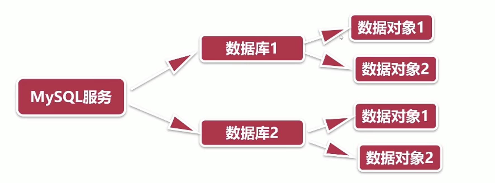

Oracle和MySQL的区别
===

- 组织对象的方法不一样，对象包括表、视图、索引，存储过程等等。mysql的对象属于数据库。oracle的对象属于用户  oracle不用数据库这个概念。
- 数据类型。它们在本质上没有不同，只是语法和关键字不同而已。

MySQL数据类型
===

固定长度字符串

可变长度字符串

整数

浮点数

时间

二进制大对象

在Oracle中时间需要指定它的缺省值为sysdate

mysql用的是keyid(自增字段)，Oracle用的是序列生成器在oracle数据库的11节有写

在mysql中一个表只有一个自增字段，并且还要把它设置为唯一键，oracle没有这个限制，一个表可以有多个自增字段，甚至没有自增字段这个说法。字段是不是自增由业务的需求决定，

如果我们把序列生成器的值填到字段中，它就成了自增字段，

oracle不要求把自增字段设置为唯一键，但是我们一般会把自增字段设置为唯一键，或者用它创建唯一的索引。oracle的序列生成器很强大，但也有不好的地方，比如设计表的时候不能直接把某个字段的缺省值指定为序列生成器的值一定要在SQ语句中把序列生成器的值填进去，刚才那个文档中有使用的方法。

