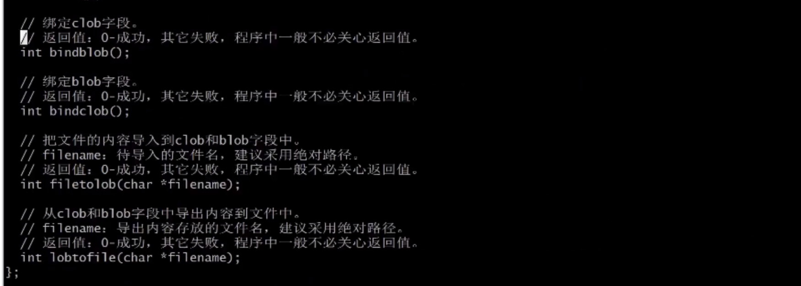
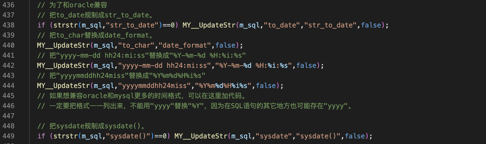
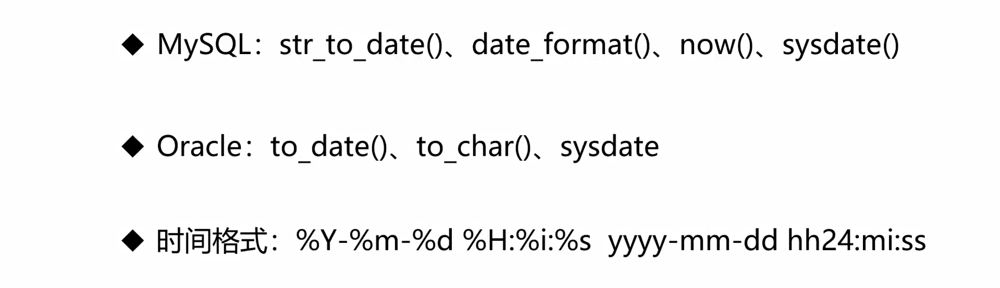
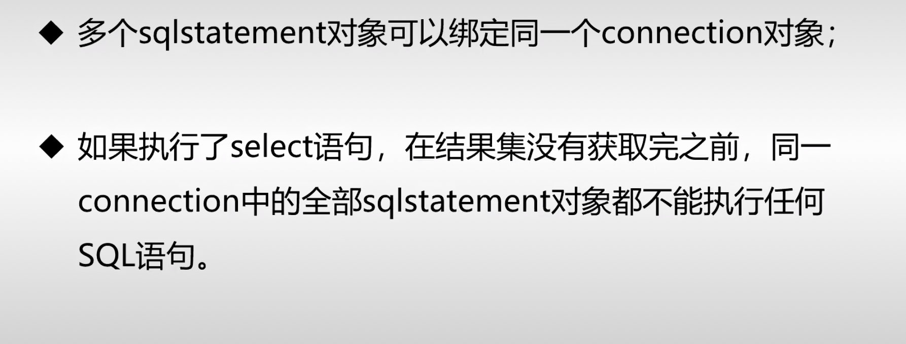
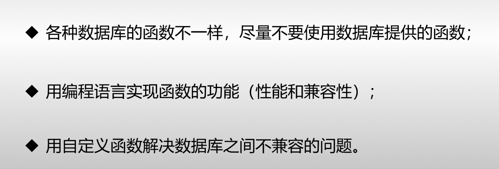
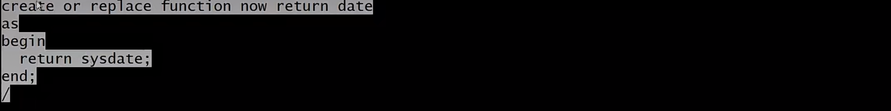

只有二进制大对象操作的几个函数有一点不同

Oracle数据库开发基础
===

- connection和sqlstatement类的使用和编译
- Oracle错误代码
- 其他注意事项(查询语句的结果集、**数据库函数**的使用)

时间函数‼️
---

**mysql的sysdate()有括号，而Oracle没有括号**

为了解决mysql和Oracle时间函数不兼容的问题，在开发框架中做了一些处理_mysql.cpp

- MySQL：str_to_date() (把字符串转换为日期)、data_format() (日期转换为字符串)、             				 now()、sysdate() (这两个都是取当前时间)

- Oracle：to_date() ((把字符串转换为日期))、to_char() (日期转换为字符串)、

     			sysdate( 取当前时间)

- 时间格式：%Y-%m-%d %H:%i:%s (mysql)           yyyy-mm-dd hh24:mi:ss (oracle)

对于mysql

数据库函数
---

### 用自定义函数解决不兼容问题

比如在Oracle中没有now这个函数

在Oracle中使用这个就可以使用now这个函数

