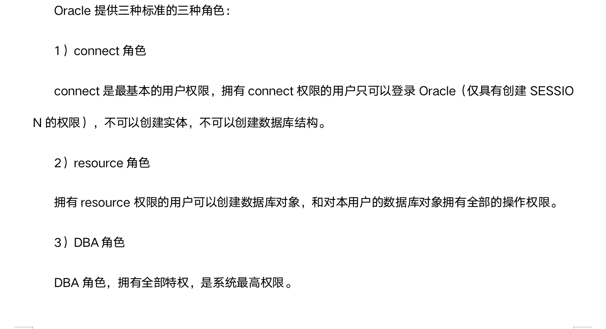

修改数据入库子系统，增加对Oracle数据库的支持

修改数据入库子系统
===

- 准备测试数据(从MySQL数据库中抽取)

- 在Oracle数据库中创建表(用户权限、序列生成器、PowerDesigner)
- 新增xmltodb_oracle.cpp程序，把xml文件入库到Oracle的表

数据中心全部的数据对象包括表、索引、视图、函数等都存放在新创建的用户中，创建数据库用户涉及到oracle用户和权限管理方面的知识在oracle数据库的28节有写

在创建用户时需要在管理员oracle中用这几个函数给他们授予权限

**grant connect to qxidc;**

**grant resource to qxidc;**

在Oracle中时间需要指定它的缺省值为sysdate

mysql用的是keyid(自增字段)，Oracle用的是序列生成器在oracle数据库的11节有写

在mysql中一个表只有一个自增字段，并且还要把它设置为唯一键，oracle没有这个限制，一个表可以有多个自增字段

序列生成器的脚本写法

