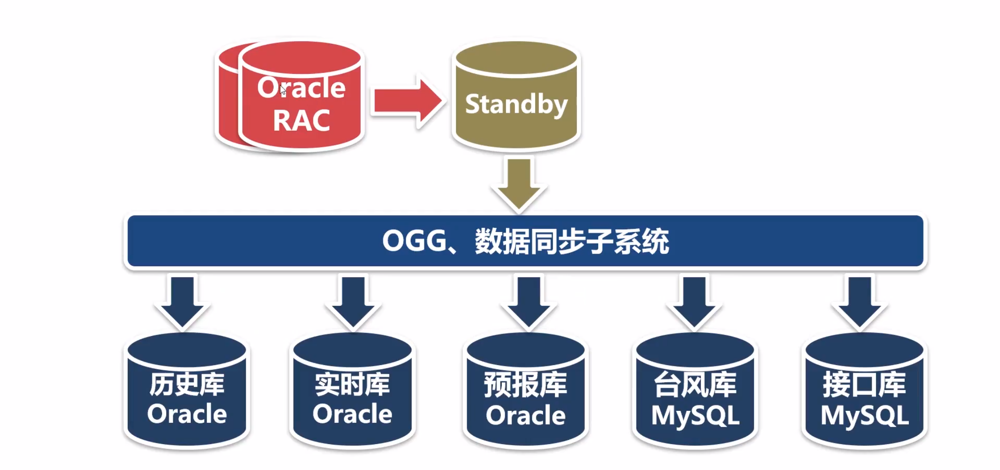
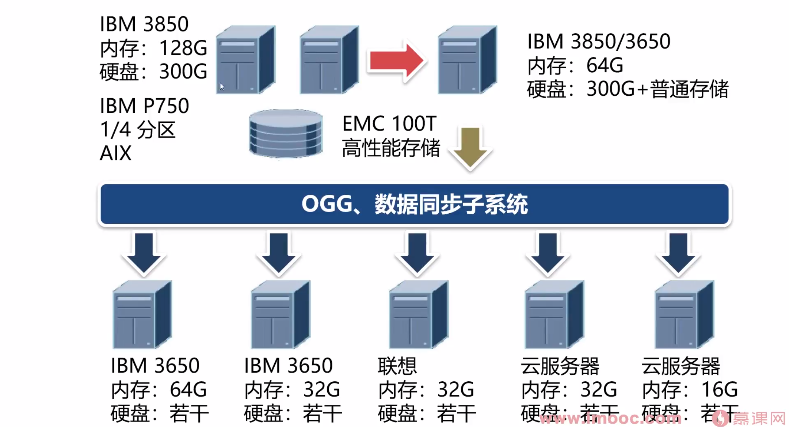
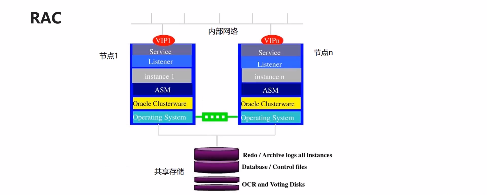
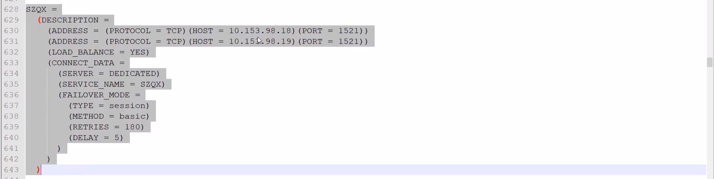
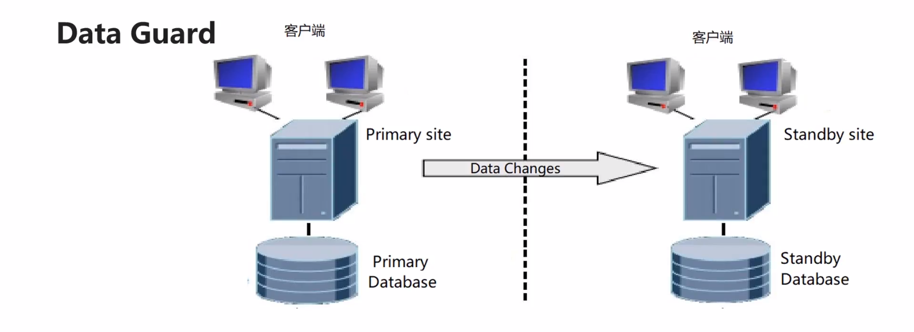
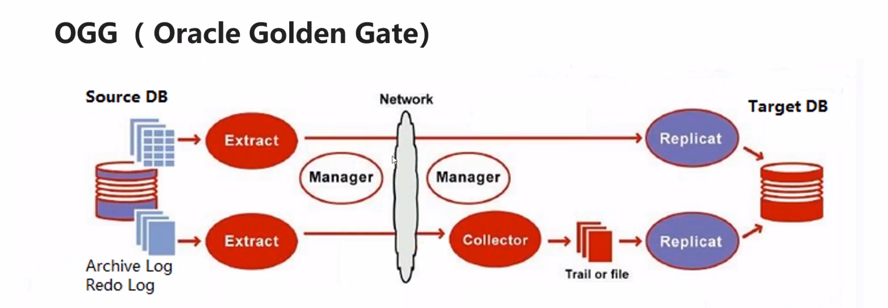

Oracle数据库集群方案
===

下面是数据中心这项目的数据库集群架构
---

下面是数据中心的硬件方案
---

先从rac的节点开始，低配置选择IBM的三八五零服务器，内存64g或者128g。硬盘300g是指服务器的本地硬盘，本地硬盘上只安装操作系统和数据库软件300g足够了。数据存放在存储设备上，用EMC，它的存储比ibm还要好，存储设备又叫存储服务器，它的容量一般都很大，具体要看业务的需求，高性能存储分给数据库用，空间不大但是很贵，rac也可以用小型机，一个ibm的p750的小型机可以分成四个区，操作系统为AIX，AIX是unix的一种一个区比ibm的3850的服务器还要好，我们写的c程序可以在aix上直接编译，没有本质的区别

再看Standby，它的目的是容灾备份，硬件配置不需要很高3850好一点五万以上，3650两万多

RAC（Real Application Cluster实时应用集群）
---

- 由多个服务器加共享存储，一般两个节点，高可用方案，不是高性能的解决方案，它的目的是保证数据库永远在线，因为RAC的多个实例共享一个存储设备，存储设备的性能决定了整个数据库的性能，rac写入数据的时候多个节点之间需要协调，协调会消耗资源所以性能比单实例略低，读数据略高
- 用更多廉价的服务器不能提升rac的性能
- Mysql Cluster的原理和rac相似，稳定性和效率不高

搭建一个rac大概需要100万，rac的节点可以有很多个，在实际项目中一般是两个节点，写入数据的性能在5000条每秒

如果是RAC数据库连接这样配置，一个ip对于一个oracle实例，某一个实例出现故障的时候connection不会断开，其他的实例会把connection接管过去，业务不会受到影响

在硬件上他们是由多个服务器加共享存储组成的。服务器可以有很多个，但存储设备只有一个。在RAC中，每个服务器上都安装了操作系统和oracle数据库软件，启动了oracle实例，但是。多个oracle实例用的是同一份数据，当某一个服务器出现了故障，不管是硬件设备坏了还是网线断了。数据库群可以继续工作，业务不会断开。如果存储设备发生了故障，整个RAC就玩完了，但是存储设备没那么容易发生故障，它自带容错机制，稳定性比服务器还要好很多。价格也特别的贵

Data Guard数据同步，
---

- oracle自带的数据同步功能，把日志文件从源数据库传到目标数据库，然后在目标数据库上应用这些日志文件，从而使目标数据库与原数据库保持同步，这是一种数据库级别的高可用方案，相当于mysql的主从复制，mysql叫master和slaver，oracle叫primary和standby，用于异地备份，读写分离

### 用途

用于灾难备份和故障恢复(异地)

读写分离不是Data Guard的主要目的，在oracle的高可用方案中，让多个从数据库为主数据库分担读的压力，这种效果有点夸大，因为oracle数据库有更好的解决方案，为了解决读的问题，把主数据库复制成多个副本，这方法不好

OGG（Oracle Golden Gate）
---

与数据的同步或者数据复制同一个意思

- **捕捉源端数据库的日志，把发生变化的数据提取出来，生成文件发送给目标端，目标端解析文件文件的内容，应用到目标数据库中，它支持多种数据库数据同步效率比较高，非常灵活，可以配置需要同步的表**

有三个进程：

原端的抽取进程，文件传输管理进程和目标端的数据复制进程

### OGG    vs    数据同步子系统

- ogg不是oracle自带的功能，需付费

- ogg是从日志中抽取数据，对源端数据库没有压力，我们的同步程序要读取原端数据库的表，ogg对表的设计没有要求 我们的增量同步程序要求表有自增字段，还不能有修改和删除操作
- 数据同步子系统：1）部署简单    2）批量操作数据，效率更高

在实际项目中把OGG和数据同步子系统结合一起使用比较好

- 参数表数据量比较小的表、有删除和操作的表用OGG
- 数据量大、没有修改和删除操作的表用我们的同步程序来做

下面是数据中心这项目的数据库集群架构

