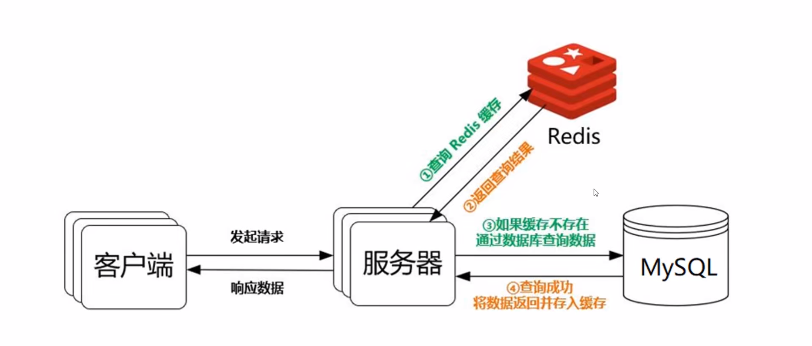

Oracle DBA
===

数据库建设方案的设计和实施

数据库日常运维、数据安全、性能分析和持续优化

数据库升级、迁移、备份恢复、扩容、容灾的设计和实施

我们要理解数据库的原理，特别是它的性能，瓶颈，设计表的时候，索引要合理。太少不能满足业务的需求，太多影响数据库的性能，程序中的SQ语句不要乱来。要充分的利用索引，尽可能减少全表扫描，

用程序实现复制和迁移

这里只能用oracle提供的工具。把大量的数据从源端导出来，再导入目标端。如果数据表有几十亿，生成的临时文件会非常的大。我们可以把数据同步程序稍微改一下，就可以实现数据复制和迁移的功能，并且不会生成临时文件。

数据同步子系统很灵巧，可以使集群方案更加的完善 

Oracle的新特性
===

- 云计算特性、大数据特性、智能化这个特性
- inmemory技术大幅提升了数据读取的性能
- 通过SQL语句进行机器学习模型的训练

一是inmemory技术，它的原理很简单，就是把表放到内存中去。它不能提升写入数据的性能，但是读取数据的性能可以提升几十倍。

二是通过SQ语句进行机器学习模型的训练，让数据库技术朝智能化的方向发展。它可以更合理的分配资源。

inmemory技术，在oracle 21c才有的。开始的时候需要dba配置参数，决定哪些表放在内存中，但是在oracle 21c中已经不需要dba配置参数了。数据库可以自己决定哪些表应该放在内存中，机器学习比人更智能。

如下图这种方案：如果数据库不够快，让redis来做缓存，提升读取数据的效率。如果采用的是oracle数据库，就不需要这么做了。新版本的oracle将自带这个功能，

PostgreSQL可能会成为免费数据库的主流

了解ocilib库和ooci