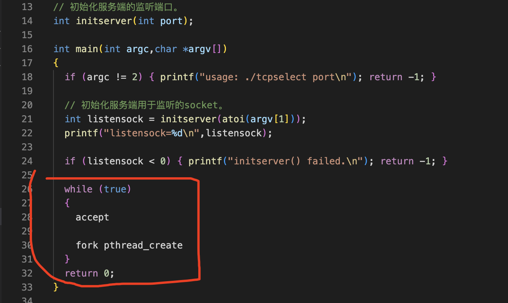
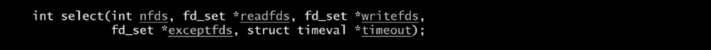
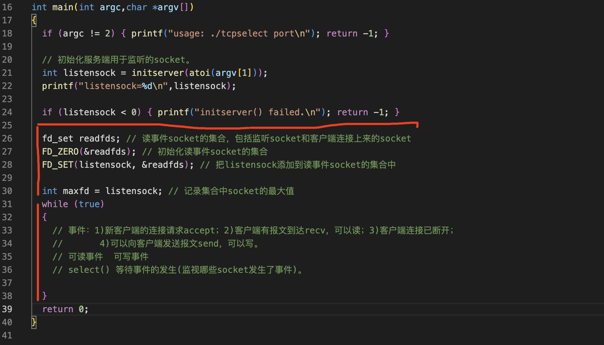
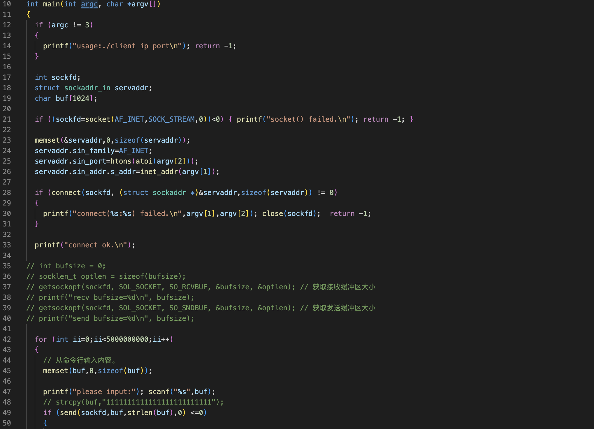
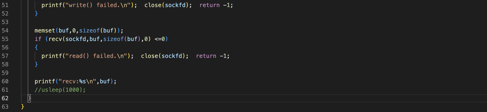
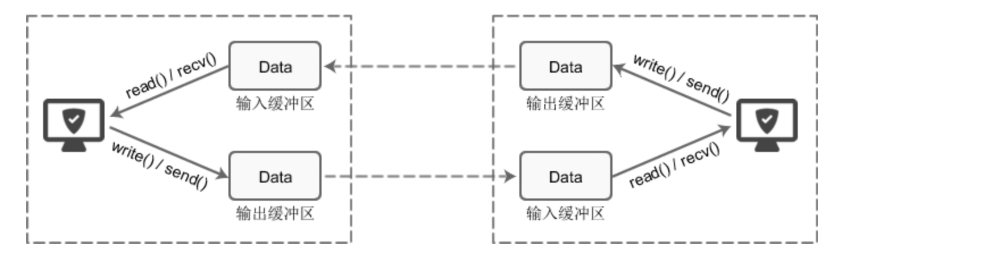
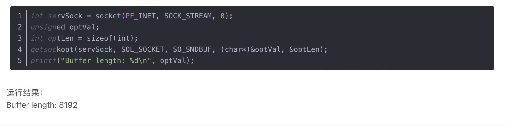

多进程和多线程的服务端程序中，应该用一个循环。在循环里面，先accept。然后在fork或者创建线程。

在select模型中，一个select函数，既可以监听客户端的连接，还可以接收客户端的报文。在IO复用模型中，事件有四种，第一种。新客户端的连接请求，第二种。客户端有报文到达，也称之为可以读第三种客户端的连接已断开。第四种可以向客户端发送报文，也称之为可以写这四种事件，分为两类。可读事件包括一二三可写事件只有4    select函数的功能是等待事件的发生。包括可读事件和可写事件，等待可读事件比较容易理解，比如说等待客户端的连接，等待客户端的报文。等待客户端关闭连接，但是可写事件不太好理解，你们可能已经形成了一个习惯的思维，如果想把报文发送给对端调用send函数直接写就行了。不存在等待的说法，想什么时候写就什么时候写，对吧？其实往socket中写数据并不是想写就一定能写的，也可能会阻塞，会等待。

这个程序的流程是先连上服务端，然后用一个循环发送十万个报文。每发送一个报文sleep 1秒，现在把代码改掉它。改为只发送报文，不接收。再来修改服务端demo零八。服务端改为只接收报文不发送。先运行服务端。在运行客户端。现在他们在快速的发送报文。服务端快速的接收基本上保持同步okay了。客户端就okay了。现在的服务端，快速的接收报文客户端，快速的发送报文，大家都很快，所以客户端的这个函数不会阻塞。我们把服务端程序改一下，让它慢下来。sleep很短的时间。先运行服务端。在运行客户端。我们看到客户端比服务端要快。客服端现在停下来了。服务段还在跑。客户端又跑了一会，现在又停下来了，等一会他还被接着跑。跑完了，我们看到服务端还在跑。客户端已经跑完了。服务端也跑完了，

- TCP有缓冲区，如果缓冲区已填满三个函数也会阻塞。
- 如果发送端关闭了窗口，缓存区中的数据会继续发送给接收端，不会丢失。

可写事件可以简单的理解为，只要TCP的缓冲区没有满，那么就可以写。select函数的功能是等待事件的发生，我们可以让他监视哪些socket发生了事件。它可以同时监视多个socket，所以用单进程也可以实现并发的功能

过程
===

服务端
---

服务端初始化完成之后，先声明一个socket的集合，用于存放读事件的socket，包括监听的socket和客户端连上来的socket。

然后初始化这个集合，再把监听的socket加入这个集合中。再声明一个变量记录集合中socket ID的最大值。接下来，在循环中调用select监视有事件发生的socket

客户端
---

client.cpp

客户端程序是先初始化，再连上服务端，然后是一个死循环，在循环里面等待用户输入数据，然后把用户输入的数据发送给服务端,再接收服务端的回应

扩展
===

tcp的缓冲区
---

一、先上结论

什么是tcp缓冲区？每个 socket 被创建后，都会分配两个缓冲区，输入缓冲区和输出缓冲区。

二、缓冲区的意义
write()/send() 并不立即向网络中传输数据，而是先将数据写入缓冲区中，再由TCP协议将数据从缓冲区发送到目标机器。一旦将数据写入到缓冲区，函数就可以成功返回，不管它们有没有到达目标机器，也不管它们何时被发送到网络，这些都是TCP协议负责的事情。
TCP协议独立于 write()/send() 函数，数据有可能刚被写入缓冲区就发送到网络，也可能在缓冲区中不断积压，多次写入的数据被一次性发送到网络，比如nagle算法，这取决于当时的网络情况、当前线程是否空闲等诸多因素，不由程序员控制。
read()/recv() 函数也是如此，也从输入缓冲区中读取数据，而不是直接从网络中读取。

图：TCP套接字的I/O缓冲区示意图
三、I/O缓冲区特性

1、I/O缓冲区在每个TCP套接字中单独存在；

2、I/O缓冲区在创建套接字时自动生成；

3、即使关闭套接字也会继续传送输出缓冲区中遗留的数据；

4、关闭套接字将丢失输入缓冲区中的数据。

输入输出缓冲区的默认大小一般都是 8K，可以通过 getsockopt() 函数获取：

如果TCP连接断开，网络缓冲区还有为发出去的数据，下次连接后会继续发送么，还是清空缓冲区？
---

接收端tcp断开，分为两种情况：1. 调用close主动断开，执行tcp三次挥手，正常结束。2. 接收端断网或者宕机，此时发送端是无法知道接收端已经断开，会一直往那个已经断开的socket缓冲区发数据，知道缓冲区满就会阻塞；如果接收端重新连接上来的话，此时不会继续发送数据，因为重连的socket已经变了，缓冲区会进行了重建；老的已经断开的socket需要发送端自己处理，即调用 clientSocket.close() 清理掉废弃的socket回收相应资源