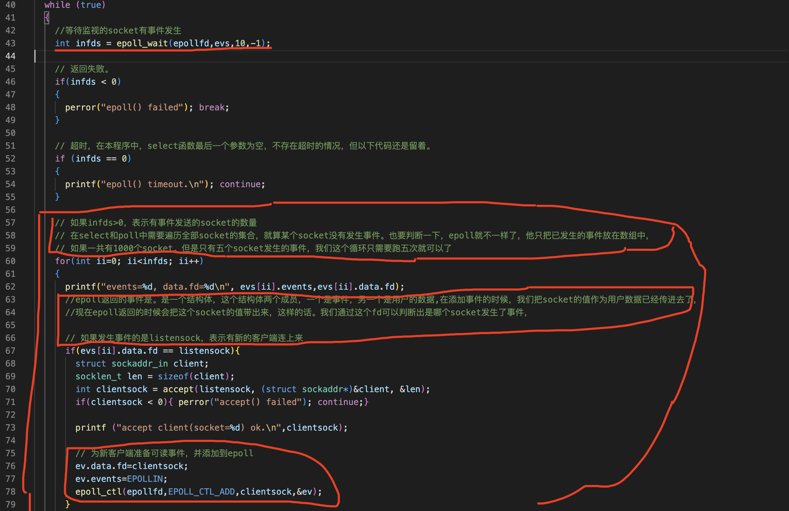

epoll和select相比，他的意义不是每秒八万和六点六万的差别，而是当客户端达到十万个连接的时候。epoll的性能也不会下降，十万个连接这种测试在虚拟机上模拟不出来，

优点
===

- epoll性能卓越，是高性能网络框架的基础( nginx redis rpc libevent)
- epoll模型没有内存拷贝，没有轮询，没有遍历

操作epoll函数
===

1 创建句柄
---

int epoll_create(int size);

首先用epoll函数创建epoll句柄，epoll句柄可以理解为socket的集合，就像select中的bitmap。poll中的数组

2 注册事件
---

int epoll_ctl(int epfd, int op, int fd, struct epoll_event *event);

第一个是epoll句柄，第二个是操作的方法 有三种EPOLL_CTL_ADD增加事件 EPOLL_CTL_MOD修改事件 EPOLL_CTL_DEL删除事件，第三个是需要操作的socket 第四个表示事件的结构体

结构体的第一个成员是需要操作的事件，第二个成员是用户的数据。先看第一个成员epoll的事件。epoll的事件几种，我们先关心可读事件和可写事件。第二个成员是用户数据，他是一个共同体，epoll在添加事件的时候。把用户数据传给epoll，epoll返回的时候会把这些数据原封不动的带回来，

然后用epoll_ctl函数注册事件，意思是告诉epoll需要监视哪些socket的什么事件。

3 等待时间
---

int epoll_wait(int epfd, struct epoll_event *events, int maxevents, int timeout);

第一个参数是epoll句柄，第二个是已发生事件的数组，也就是说如果发送了事件，epoll把已发生的事件清单放在这个数组里面，这个数组的内存空间需要我们在程序中预先分配好，第三个参数是epoll数组的大小，第四个参数是超时时间

下面是epoll的返回值，如果成功返回已准备好事件的个数，如果失败返回-1，失败的原因有四个

接下来是调用epoll函数等待事件的发生。

为什么可以通过fd判断出socket发生了事件？
===

在添加事件的时候，我们把socket的值。作为用户，数据已经传进去了，现在一epoll返回的时候会把这个socket的值带出来，这样的话。我们通过这个fd可以判断出是哪个socket发生了事件，

不管你有没有明白，我来做一个测试。在这里，我把事件的结构体的值打印出来。下面这些代码把它注释掉。先运行服务。服务端监听的socks3在运行客户端。看看服务端。终止它。刚才服务端不断的显示一行内容，是因为epoll缺损的模式是水平触发，如果通知的事件没有处理，就会不断的提示。

过程
===

/root/project/public/socket/tcpepoll3.cpp

epoll是linux里面才有的window里没有所以头文件在这个目录

最终代码
===

只改了主函数的代码

C:\app\gmc\product\11.2.0\client_1\network\admin