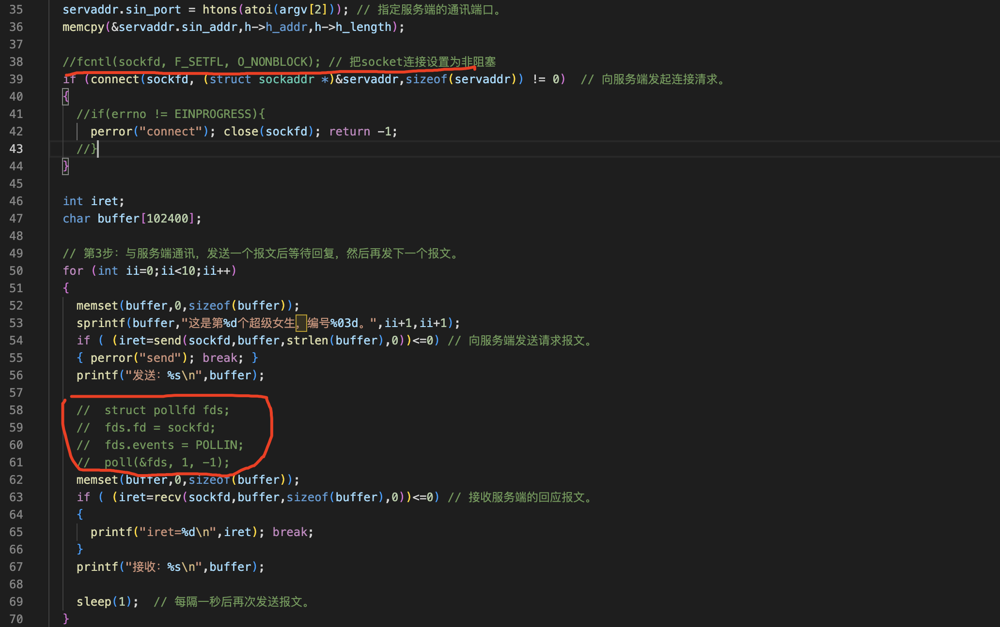

阻塞/非阻塞IO
===

- 阻塞：程序在调用结果返回之前，会等待，得到结果之后才会返回
- 非阻塞：不管调用是否得到结果，程序都不会等待，立即返回
- 缺省阻塞的函数：connect()、send()、recv()、accept()

非阻塞IO一般在IO复用的场景中使用

当把socket连接设置为非阻塞，用下面的poll来解决客户端发送报文之后要立即接受报文的这一问题(因为设置了为非阻塞)，也可以用其他的 

