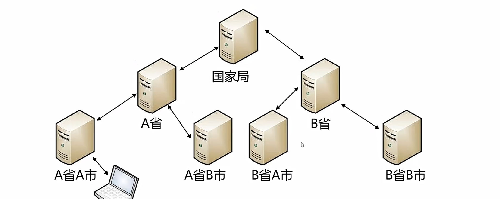

/root/project/tools1/c/inetd1.cpp

正向代理
===

简单的表示了各级气象局之间的网络关系。气象局是一个政府部门存在上下级关系。供给气象局之间的网络是连通的。但是不完全互通。最上面是中国气象局,中间这一层是各省的气象局 最下面，这一层是各市的气象局。国家局跟每个省气象局之间的网络是连通的。可以互相访问。但是省与省之间是不通的。某个省和它全部的市之间的网络是连通的。但是市与市之间不通。这种网络关系非常的典型，任何政府部门和任何企业都是这样

我们可以写一个网络代理程序，把中间的这些节点连起来。具体的方法可以这样，比如说这里有ABC三个服务器。a和b是连通的。b和c是连通的。在c服务器上部署了Web服务端口是80。那我们可以在b服务器上运行代理程序。把5080端口的报文全部转发到c的80端口去。这种方法就是正向代理。

实现思路
---

- 监听客户端的连接。如果有客户端连上来，代理程序向目标地址和端口发起连接，请求建立连接。
- 与客户端socket<--->与服务端的socket
- 代理程序是一个中间人的角色。与客户端和服务端都建立了sock连接。不管哪个socket连接收到了报文，原封不动的发给对端

用epoll单进程单线程就行