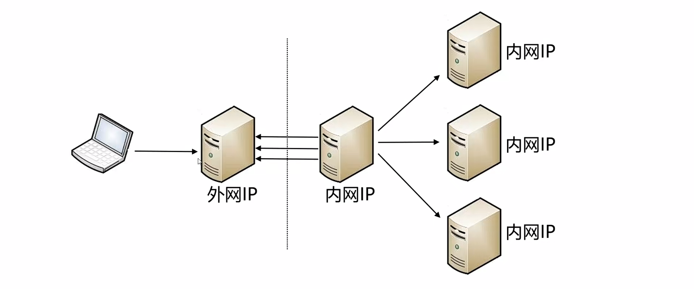
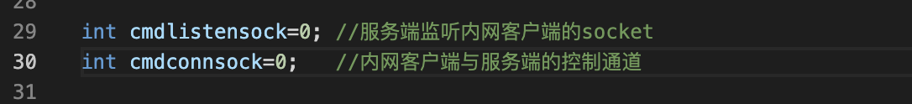

/root/project/tools1/c/rinetd1.cpp.  运行在外网

/root/project/tools1/c/rinetdin1.cpp   运行在内网

开发反向代理模块(上)
===

这是反向代理完整的网络结构图。虚线左边的是外网，一般指互联网，右边是企业的内部网络，这几台服务器之间的关系是平等的。大家可以互相访问，从外网没有办法直接访问企业内网的服务器，只能通过反向代理来实现。反向代理的服务程序部署在外网和内网某一个服务器上，大家认真的想一下。有什么方法，具体怎么做？反向代理服务程序部署在外网。某一台内网的服务器上，程序运行之后，由内网向外网发起TCP连接，建立一条通道。这条通道叫控制通道或者命令通道，外网的代理服务程序监听其他的客户端连接请求。如果有客户端连上来，外网通过控制通道向内网服务器发送命令，告诉他帮我连内网的某一个服务器。内网的代理程序收到命令之后，同时向内网的目标服务器和外网的代理服务程序发起TCP连接   这样的话，从客户端到内网目标的服务器之间一共有三条传输通道。把这三条传输通道对接起来就可以了，

控制通道只用于外网向内网下达连接指令，不传数据，控制通道只有一条。传输通道有多条，有多少个客户端连上来就会有多少条传输通道


代理路由的参数

#  

```
#参数格式  监听端口。目标ip。  目标端口
3005     101.43.160.209   5005  #demo02程序的通讯端口，用于测试
3006     101.43.160.209   3306  #mysql数据库的端口
3021     101.43.160.209   1521  #oracle数据库的端口
3022		 101.43.160.209     22  #ssh协议
3080		 101.43.160.209   8080  #数据服务总线的端口
```

过程
===

1 外网需要增加两个socket，一个是外网服务端用于监听内网客户端的socker。第二个是内网客户端与服务端的控制通道的socket。



