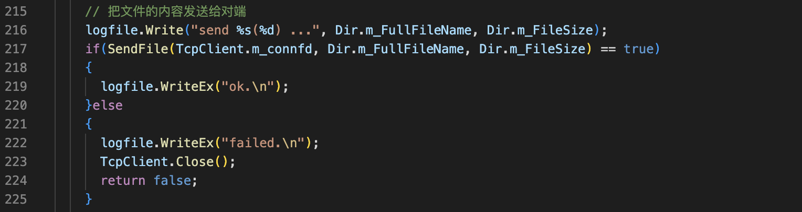
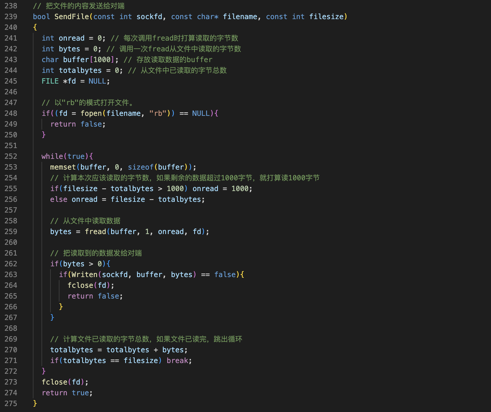
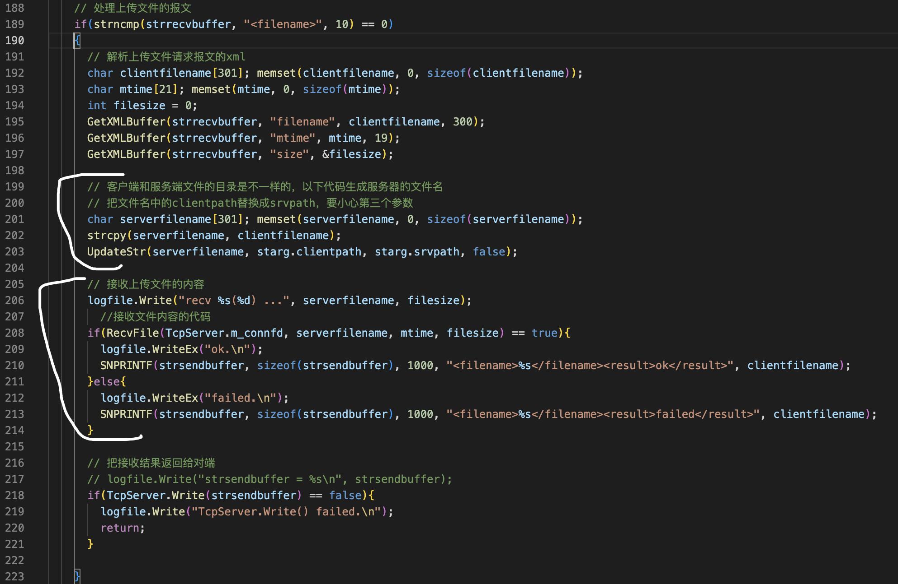
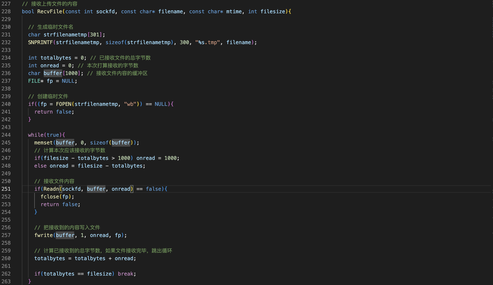
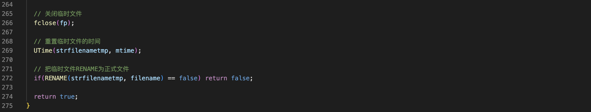

过程
===

客户端
---

在文件上传主函数中添加

服务端
===

第一步，生成临时的文件名。接收到的文件内容先存放在临时文件中，等这个文件的内容全部接收完成之后再改名为正式的文件。

第二步，创建临时文件。然后利用一个循环，这个事情就好像搬砖一样，在循环里面先计算一下，每次应该接收的字节数。然后再接收文件的内容，再然后把接收到的内容写入文件。最后再计算一下，已接收文件的总字节数，如果文件接收完跳出循环。

第三部，文件接收完之后。在循环的外面关闭临时文件。然后再重置文件的时间，最后再把临时文件改为正式的文件。

接下来把代码填进去。先生成临时文件名，临时文件名在正式的文件名后面加一个点tmp就可以了。然后定义几个变量。以接收文件的总字节树结束。再定义一个buffer。还需要一个文件指针。接下来，打开临时文件，打开文件要**注意不能够用原始的fopen用框架里面的大写FOPEN这个函数。这个函数它会创建目录**。用wb的方式。循环里面先出初始化buffer。然后计算本次应该接收的字节数。然后接收文件的内容。接触文件的内容用框架里面的red n函数，不要用recv。

如果接收失败，关闭文件指针函数返回false。把接收到的内容写入文件。计算已接收文件的总字节数。如果文件已经接收完，跳出循环。

在循环的外面，先关闭临时文件。然后重置文件的时间。重置文件的时间用框架里面的UTime函数。这里我解释一下。**如果没有重置文件的时间，那么文件的时间就是传输这个文件的时间。传输这个文件的时间是没什么意义的。这个文件原始的时间更有意义。**最后把文件改名返回false。这里一般不会失败。

