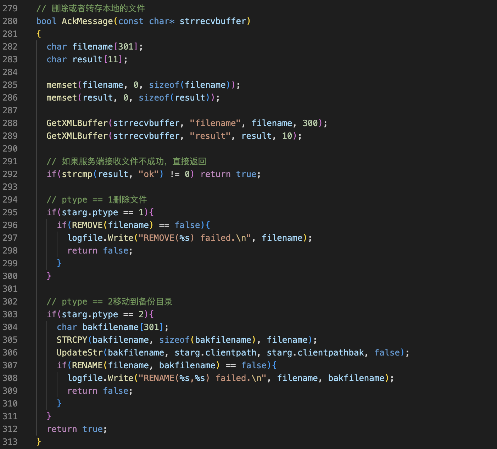

过程
===

客户端
---

在文件上传主函数中添加

文件传输之后。收到对端的确认报文，然后删除或者转成本地的文件。这些代码我们放在一个函数里面。把这个buffer传进去就可以了。

函数名叫AckMessage。在mail函数外面声明它。再来写它的函数体。服务端的确认报文有两个字段，一个是文件名，还有一个是结果，结果只有OK。那么，在客户端这边先解析这个buffer。变量初始化。然后解析buffer。先判断服务端确认的结果，也就是result字段，如果不是OK，那么什么都不用做，函数返回。然后再判断ptype，如果ptype=1表示删除文件。p type=2表示，移动到备份目录。删除文件。转存到备份目录。先生成备份目录的文件名。把这个文件名拷过去，然后。再把目录替换掉。注意最后一个参数，要用false(表示不要循环的执行替换)，然后再改名。其实这节课新增的代码都在客户端，服务端是没有变的，

