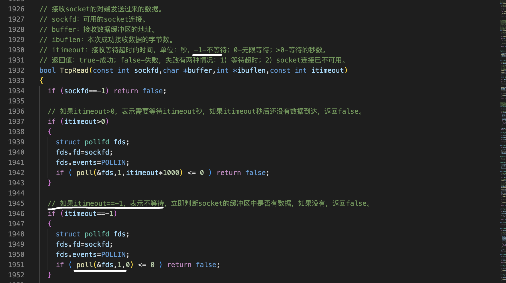

异步通信的实现
===

- 多进程：用不同的进程发送报文和接收报文
- 多线程：用不同的线程发送报文和接收报文
- I/O复用：select、poll、epoll函数

重要‼️
---

用grep这个命令搜索日志文件的内容。搜索的内容可以更精确一些，精确到每一秒，这样的话我们可以统计每一秒，它发送了多少报文，比如说39秒发送了109个。40秒1692

**用grep在管道输出wc这种方法是我们经常用到的。在统计日志文件里面的行数的时候非常有用！**

1 演示异步通信(多进程)的效率
===

客户端
---

父进程只发送报文，子进程只接收报文


```c++
/*
 * 程序名：demo31.cpp，此程序是网络通信的客户端程序，用于演示异步通信（多进程）的效率。
 * 作者：gmc。
*/
#include "../_public.h"
 
int main(int argc,char *argv[])
{
  if (argc!=3)
  {
    printf("Using:./demo31 ip port\nExample:./demo31 101.43.160.209 5005\n\n"); return -1;
  }

  CTcpClient TcpClient;

  // 向服务端发起连接请求。
  if (TcpClient.ConnectToServer(argv[1],atoi(argv[2]))==false)
  {
    printf("TcpClient.ConnectToServer(%s,%s) failed.\n",argv[1],argv[2]); return -1;
  }

  char buffer[102400];

  CLogFile logfile(1000);
  //报文的内容输出到日志文件
  logfile.Open("/tmp/demo31.log","a+");
int pid=fork(); 
  // 与服务端通讯，发送一个报文后等待回复，然后再发下一个报文。
  for (int ii=0;ii<1000000;ii++)
  {
if (pid>0)
{
    SPRINTF(buffer,sizeof(buffer),"这是第%d个超级女生，编号%03d。",ii+1,ii+1);
    if (TcpClient.Write(buffer)==false) break; // 向服务端发送请求报文。
    logfile.Write("发送：%s\n",buffer);
}
else
{
    memset(buffer,0,sizeof(buffer));
    if (TcpClient.Read(buffer)==false) break; // 接收服务端的回应报文。
    logfile.Write("接收：%s\n",buffer);
}
  }
}


```

服务端

```c++
/*
 * 程序名：demo32.cpp，此程序是网络通信的服务端程序，用于演示同步通信的效率。
 * 作者：gmc
*/
#include "../_public.h"
 
int main(int argc,char *argv[])
{
  if (argc!=2)
  {
    printf("Using:./demo32 port\nExample:./demo32 5005\n\n"); return -1;
  }

  CTcpServer TcpServer;

  // 服务端初始化。
  if (TcpServer.InitServer(atoi(argv[1]))==false)
  {
    printf("TcpServer.InitServer(%s) failed.\n",argv[1]); return -1;
  }

  // 等待客户端的连接请求。
  if (TcpServer.Accept()==false)
  {
    printf("TcpServer.Accept() failed.\n"); return -1;
  }

  printf("客户端（%s）已连接。\n",TcpServer.GetIP());

  char buffer[102400];

  CLogFile logfile;
  logfile.Open("/tmp/demo32.log","a+");

  // 与客户端通讯，接收客户端发过来的报文后，回复ok。
  while (1)
  {
    memset(buffer,0,sizeof(buffer));
    if (TcpServer.Read(buffer)==false) break; // 接收客户端的请求报文。
    logfile.Write("接收：%s\n",buffer);

    strcpy(buffer,"ok");
    if (TcpServer.Write(buffer)==false) break; // 向客户端发送响应结果。
    logfile.Write("发送：%s\n",buffer);
  }
}

```

2 演示异步通信（poll）效率
===

这个地方应该用一个循环，如果有回应报文就继续读取。没有的话就不读了


在开发框架中TcpRead这个函数。它的第三个参数如果取值为负一表示不等待。在函数里面，如果取值为负一的话，用poll处理



这个地方应该用一个循环，如果有回应报文就继续读取。没有的话就不读了。然后需要在循环的外面继续接收回应，不然会出现一些bug


采用IO复印技术的函数实现异步通信，它的效率比多进程和多线程会低一点。原因就是因为这些代码需要开销。肯定比不上让一个进程或者一个线程在那里等待，