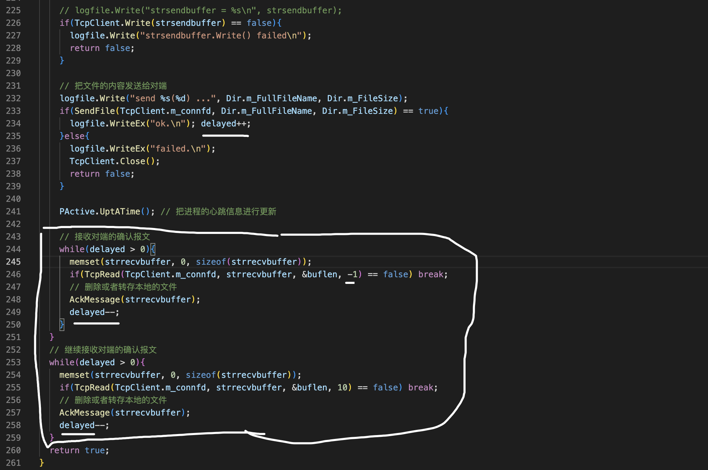
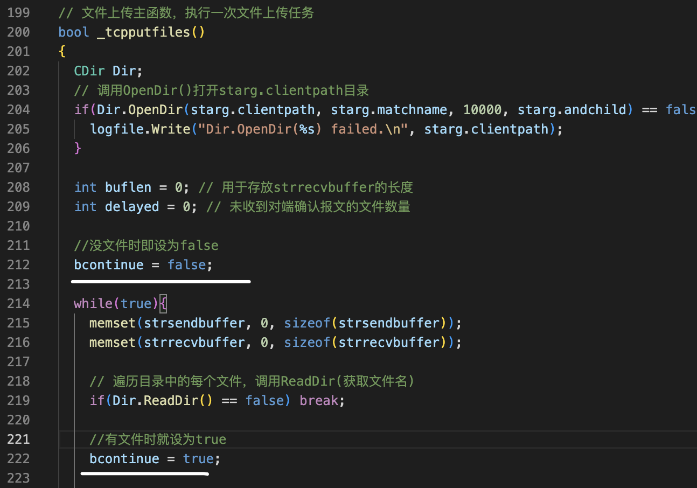
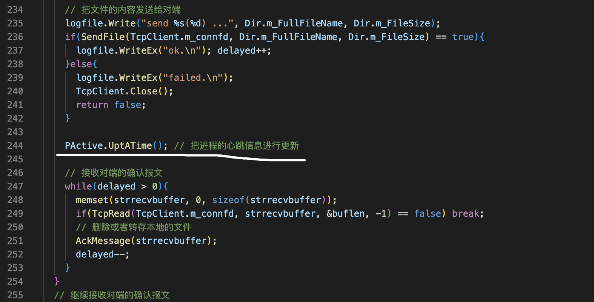
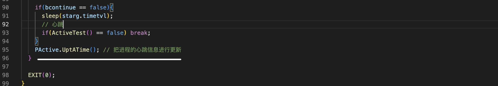
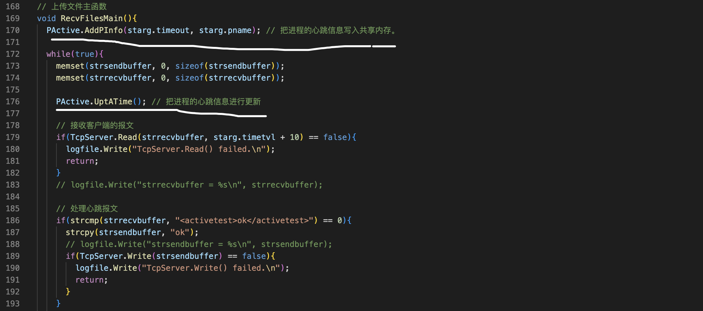

采用IO复用技术的poll来实现，虽然多进程和多线程的异步通信效率更高，但是进程或线程之间需要做同步比较麻烦

过程
===

客户端 tcpputfiles5.cpp

修改文件上传的主函数定义一个变量用于记录未收到确认报文的文件数量。这个变量初始化为零，每发送一个文件，它的值加一。

每收到一个文件的确认报文，它的值减1，然后往下。成功发送一个文件，它的值加1。然后接收对方的确认包围这些代码要修改改为框架中的TcpRead的函数。这里用一个循环循环的条件是有确认报文没有回来。第一个参数客户端的sock。第二个参数buffer。这里要把buff初始化。第三个参数存放了，接收到的buffer的长度。最后一个参数填负一，如果没有接收到报文就break。

接下来是接收到了报文的情况。在循环的外面继续再接收对端的确认报文。这里改一下这个参数，不能够用负一了，一般来说报文延迟也就一两秒，不可能会延迟太久。所以这里填十秒足够。这里这个变量要放到循环的外面。

收尾工作
===

客户端
---

先来看这个变量，扫描本地目录文件的时间间隔，单位是秒在程序的主流程中，每执行一次文件上传的任务就sleep这么多秒。这种方法不是最合理的，为什么这么说？给大家举个例子，比如说这个目录下他不断的有文件生成。可能是一秒钟几个，也可能是几秒钟一个，没什么规律，现在这个目录下有20个文件。程序运行一次文件传输的任务，把这20个文件给传出去了。但是在传输文件的过程中，就有文件不断的生成，那么后面生成的这些文件要等到。下一次执行文件传输任务的时候，才会被传输，

我们可以做一些优化，每次执行文件传输任务的时候。如果有成功传输文件，说明系统比较忙，那么在执行完这次文件传输任务之后，就不要sleep了。继续去执行文件传输的任务。如果执行某次文件传输任务，没有传输的文件，这时候才认为系统是比较空闲的。那么就可以sleep这么做，应该更合理，按照刚才的思路，把程序优化。增加一个全局变量，

如果我执行文件传输任务的时候，有文件把它设置为true，没有文件设置为force。这个地方的代码需要修改，只有当bcontinue为false的时候表示系统是空闲的

然后再修改这个函数里面的代码，把b continue设置为false。只要有文件，就把它设置为true。

还有一个收尾的工作，就是进程的心跳。

在主函数中

然后这里空闲的时候也做一个进程的心跳。(这个是错误❌的做法)

在这个函数里面也要做进程的心跳。每发送一个文件,做一次心跳

这个地方有点问题，这行代码不应该在这里进程的，心跳跟进程的心跳不一样，对进程来说，不管程序是否忙碌，都需要做心跳。如果把心跳放在这里的话，如果程序一直比较忙，根本不会进入这里，那么进程就会被超时，所以这个心跳信息应该放在外面。这样就可以了

服务端程序也要做心跳。服务端程序的心跳在子进程里面，每个进程都要做心跳。在这个函数里面做就可以了。在循环里面，每次循环写一次心跳。fileserver5.cpp

