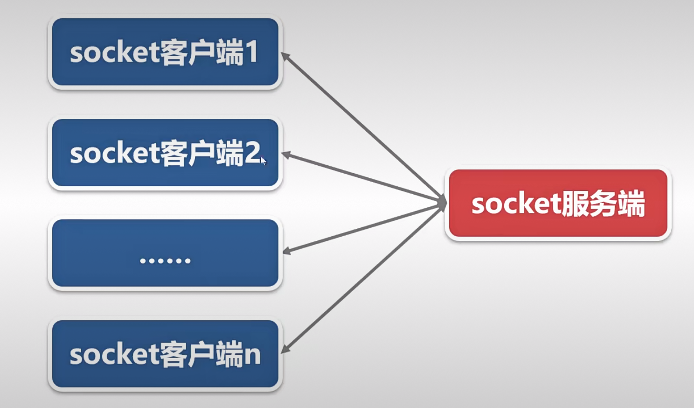
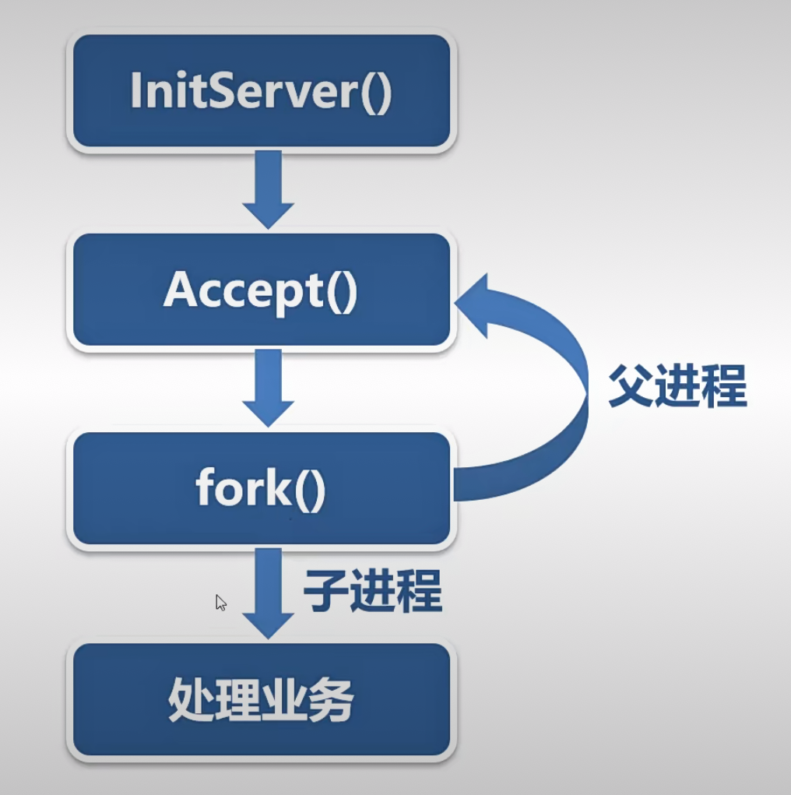
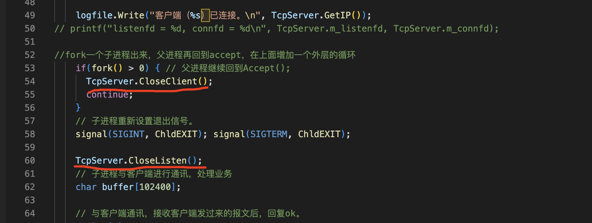

在前面的几节课中。我们已经实现了网络客户端和服务端程序通讯的功能，程序之间是一对一的关系。一个服务端只能和一个客户端通信。但是，在实际应用中，网络服务端程序与客户端程序是一对多的关系。就像这张图。

一个服务端可以同时与多个客户端进行通讯，服务端可以是多进程，也可以是多线程。如果采用IO复印技术，单进程，单线程的服务端也可以和多个客户端程序通信。这个以后再介绍，在这个章节中，我们先搞定多进程和多线程的服务端，多进程的服务程序，主体流程是这样的。

父进程先初始化服务端，然后accept等待客户端的连接。新的客户端连上了之后，复刻一个子进程出来，然后父进程回到accept，继续等待其他客户端的连接请求。让子进程与刚才连上来的客户端进行通讯处理业务。子进程与客户端的通讯方式，业务流程等等，要看具体的业务需求，没有固定的模式。

现在只要把服务端程序改一下，增加几行代码就可以同时跟多个客户端进行通讯。

在linux下面查看每个进程打开的文件

对服务端程序做一些修改，在父进程中关掉客户端的fork，在子进程中关掉Listensocket

不用这两行代码不关闭多余的文件描述符，这样行不行呢？当然也可以，但是。对一个进程来说，打开的文件描述符是有限制的，不是想打开多少就打开多少。打开的文件描述符越多消耗的资源也就越多，所以在项目开发中我们肯定会启用这两行代码。关闭多余的文件描述符。

