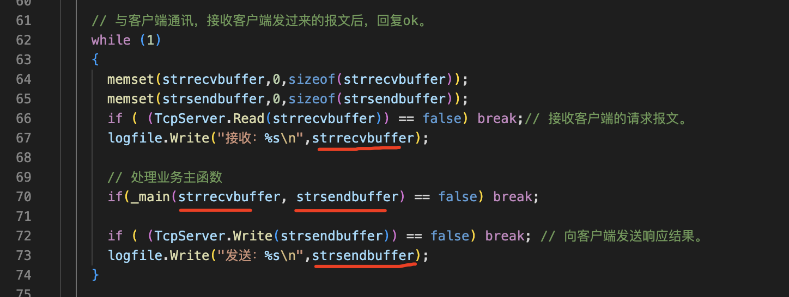
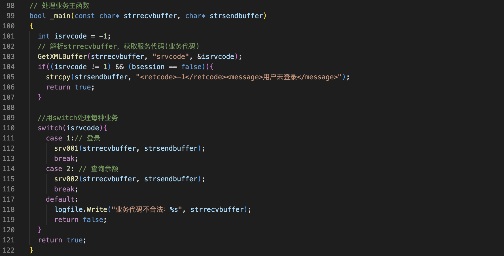
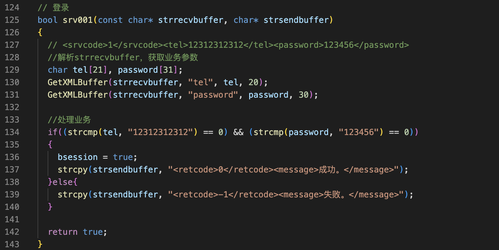
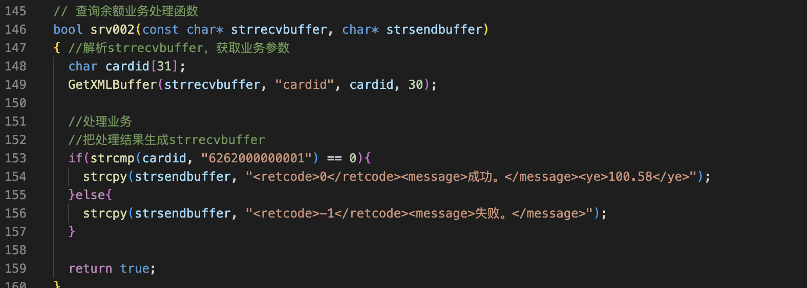

用登陆和账户这两个业务作为例子，完善多进程的网络服务端程序

过程
===

客户端
---

### 1 声明两个业务


### 2 在main函数中增加对这两个函数调用的代码


### 3 写这两个函数的结构体

服务端
---

在主函数中添加业务处理子函数需要两个参数，一个是客户端发送过来的报文，还有一个是返回给客户端的报文，也就是Read和Write这两个函数对应的buffer



### 写结构体

**业务处理主函数**



**登陆函数**



**余额业务处理函数**



注意：如果要使用这些功能有一个前提条件是用户必须是登陆成功，记录用户是否登陆成功


完整代码
===

客户端
---

```c++
/*
 * 程序名：demo11.cpp，此程序用于演示网银APP软件的客户端
 * 作者：gmc。
*/
#include "../_public.h"

CTcpClient TcpClient;

bool srv001(); // 登录业务
bool srv002(); // 我的账户（查询余额）

int main(int argc,char *argv[])
{
  if (argc!=3)
  {
    printf("Using:./demo11 ip port\nExample:./demo11 127.0.0.1 5005\n\n"); return -1;
  }

//向服务端发起连接请求
  if(TcpClient.ConnectToServer(argv[1], atoi(argv[2])) == false){
    printf("TcpClient.ConnectToServer(%s, %s) failed\n", argv[1], argv[2]);
  }

  if(srv001() == false)
  { // 登录业务
    printf("srv001() failed.\n");
    return -1;
  }
  
  if(srv002() == false)
  { // 我的账户（查询余额）
    printf("srv002() failed.\n");
    return -1;
  }

  return 0;
}

// 登录业务
bool srv001()
{
  char buffer[1024];

  //发送报文需要修改，改为XML
  SPRINTF(buffer, sizeof(buffer), "<srvcode>1</srvcode><tel>12312312312</tel><password>123456</password>");
  printf("发送：%s\n", buffer);
  if(TcpClient.Write(buffer) == false) return false; //向服务端发送请求报文

  memset(buffer, 0, sizeof(buffer));
  if(TcpClient.Read(buffer) == false) return false;  //接受服务端的回应报文
  printf("接收：%s\n", buffer); 

  // 解析服务端返回的xml
  int iretcode = -1;
  GetXMLBuffer(buffer, "retcode", &iretcode);
  if(iretcode != 0)
  {
    printf("登录失败。\n");
    return false;
  }
  printf("登录成功。\n");
  return true;
}

// 我的账户（查询余额）
bool srv002(){
  char buffer[1024];

  SPRINTF(buffer, sizeof(buffer), "<srvcode>2</srvcode><cardid>6262000000001</cardid>");
  printf("发送：%s\n", buffer);
  if(TcpClient.Write(buffer) == false) return false;  //向服务端发送请求报文

  memset(buffer, 0, sizeof(buffer));
  if(TcpClient.Read(buffer) == false) return false;   //接受服务端的回应报文
  printf("接收：%s\n", buffer);

  // 解析服务端返回的xml
  int iretcode = -1;
  GetXMLBuffer(buffer, "retcode", &iretcode);
  if(iretcode != 0){
    printf("查询余额失败。\n");
    return false;
  }
  double ye = 0;
  GetXMLBuffer(buffer, "ye", &ye);
  printf("余额为(%.2f)。\n", ye);
  return true;
}


```


服务端
---

```c++
/*
 * 程序名：demo12.cpp，此程序演示网银APP软件的服务端
 * 作者：gmc
*/
#include "../_public.h"

CLogFile logfile; // 服务程序的运行日志
CTcpServer TcpServer; // 创建服务端对象

void FathEXIT(int sig); // 父进程退出函数
void ChldEXIT(int sig); // 子进程退出函数

bool bsession = false; // 客户端是否已登录成功，true-已登录； false-未登录或登录失败

// 处理业务主函数
bool _main(const char* strrecvbuffer, char* strsendbuffer);
bool srv001(const char* strrecvbuffer, char* strsendbuffer);// 登录
bool srv002(const char* strrecvbuffer, char* strsendbuffer);// 查询余额

int main(int argc,char *argv[])
{
  if (argc!=3)
  {
    printf("Using:./demo12 port logfile\nExample:./demo12 5005 /tmp/demo12.log\n\n"); return -1;
  }

  CloseIOAndSignal(); signal(SIGINT, FathEXIT); signal(SIGTERM, FathEXIT);

  if(logfile.Open(argv[2], "a+") == false){
    printf("logfile.Open(%s) failed\n", argv[2]);
    return -1;
  }

  // 服务端初始化
  if(TcpServer.InitServer(atoi(argv[1])) == false){
    logfile.Write("TcpServer.InitServer(%s) failed.\n", argv[1]);
    return -1;
  }
  while(true){
    // 等待客户端的连接
    if(TcpServer.Accept() == false){
      logfile.Write("TcpServer.Accept() failed.\n");
      FathEXIT(-1);
      // return -1;
    }

    logfile.Write("客户端（%s）已连接。\n", TcpServer.GetIP());
// printf("listenfd = %d, connfd = %d\n", TcpServer.m_listenfd, TcpServer.m_connfd);

    if(fork() > 0) { // 父进程继续回到Accept();
      TcpServer.CloseClient();
      continue;
    }
    // 子进程重新设置退出信号。
    signal(SIGINT, ChldEXIT); signal(SIGTERM, ChldEXIT);

    TcpServer.CloseListen();
    // 子进程与客户端进行通讯，处理业务
    char strrecvbuffer[1024], strsendbuffer[1024];

    // 与客户端通讯，接收客户端发过来的报文后，回复ok。
    while (1)
    {
      memset(strrecvbuffer,0,sizeof(strrecvbuffer));
      memset(strsendbuffer,0,sizeof(strsendbuffer));
      if ( (TcpServer.Read(strrecvbuffer)) == false) break;// 接收客户端的请求报文。
      logfile.Write("接收：%s\n",strrecvbuffer);

      // 处理业务主函数
      if(_main(strrecvbuffer, strsendbuffer) == false) break;

      if ( (TcpServer.Write(strsendbuffer)) == false) break; // 向客户端发送响应结果。
      logfile.Write("发送：%s\n",strsendbuffer);
    }

    ChldEXIT(0);
    // return 0;
  }
}

void FathEXIT(int sig){// 父进程退出函数
// 以下代码是为了防止信号处理函数在执行的过程中被信号中断
  signal(SIGINT, SIG_IGN); signal(SIGTERM, SIG_IGN);
  logfile.Write("父进程退出。sig = %d.\n", sig);
  TcpServer.CloseListen(); // 关闭监听的socket
  kill(0, 15); // 通知全部的子进程退出
  exit(0);
}

void ChldEXIT(int sig){// 子进程退出函数
// 以下代码是为了防止信号处理函数在执行的过程中被信号中断
  signal(SIGINT, SIG_IGN); signal(SIGTERM, SIG_IGN);
  logfile.Write("子进程退出。sig = %d.\n", sig);
  TcpServer.CloseClient(); // 关闭客户端的socket
  exit(0);
}

// 处理业务主函数
bool _main(const char* strrecvbuffer, char* strsendbuffer){
  int isrvcode = -1;
  // 解析strrecvbuffer，获取服务代码(业务代码)
  GetXMLBuffer(strrecvbuffer, "srvcode", &isrvcode);
  if((isrvcode != 1) && (bsession == false)){
    strcpy(strsendbuffer, "<retcode>-1</retcode><message>用户未登录</message>");
    return true;
  }

  //用switch处理每种业务
  switch(isrvcode){
    case 1:// 登录
      srv001(strrecvbuffer, strsendbuffer);
      break;
    case 2: // 查询余额
      srv002(strrecvbuffer, strsendbuffer);
      break;
    default:
      logfile.Write("业务代码不合法：%s", strrecvbuffer);
      return false;
  }
  return true;
}

// 登录
bool srv001(const char* strrecvbuffer, char* strsendbuffer)
{
  // <srvcode>1</srvcode><tel>12312312312</tel><password>123456</password>
  //解析strrecvbuffer，获取业务参数
  char tel[21], password[31];
  GetXMLBuffer(strrecvbuffer, "tel", tel, 20);
  GetXMLBuffer(strrecvbuffer, "password", password, 30);

  //处理业务
  if((strcmp(tel, "12312312312") == 0) && (strcmp(password, "123456") == 0))
  {
    bsession = true;
    strcpy(strsendbuffer, "<retcode>0</retcode><message>成功。</message>");
  }else{
    strcpy(strsendbuffer, "<retcode>-1</retcode><message>失败。</message>");
  }

  return true;
}

// 查询余额业务处理函数
bool srv002(const char* strrecvbuffer, char* strsendbuffer)
{ //解析strrecvbuffer，获取业务参数
  char cardid[31];
  GetXMLBuffer(strrecvbuffer, "cardid", cardid, 30);

  //处理业务
  //把处理结果生成strrecvbuffer
  if(strcmp(cardid, "6262000000001") == 0){
    strcpy(strsendbuffer, "<retcode>0</retcode><message>成功。</message><ye>100.58</ye>");
  }else{
    strcpy(strsendbuffer, "<retcode>-1</retcode><message>失败。</message>");
  }

  return true;
}
```

