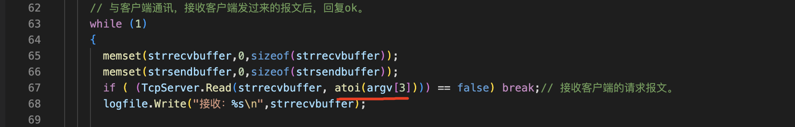
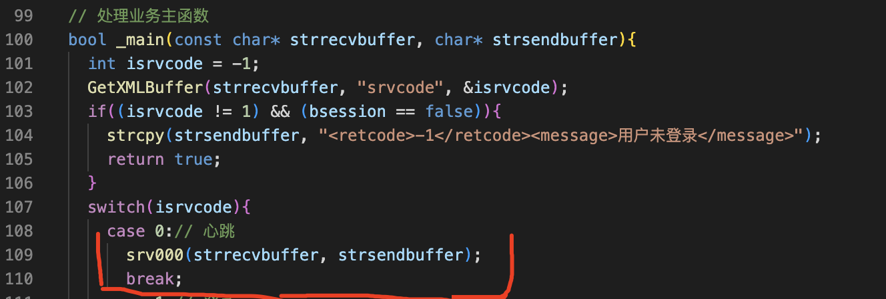
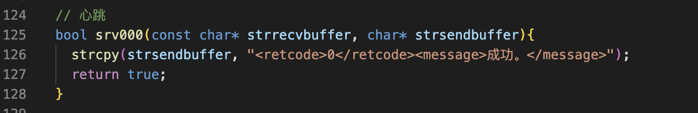
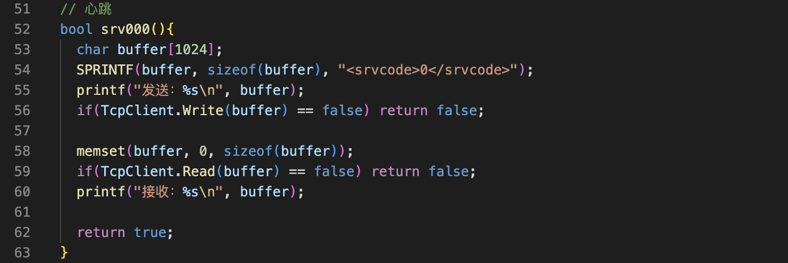
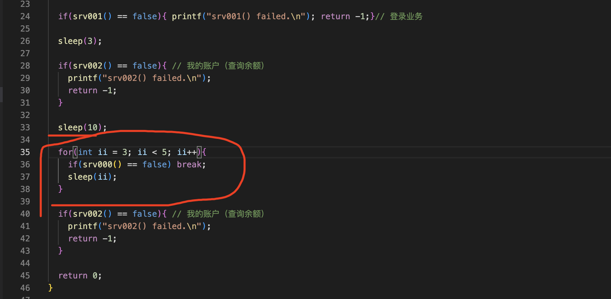

短连接

长连接

如何管理TCP连接？

采用心跳机制

TCP长连接心跳机制
===

- 服务端与客户端约定通讯超时的时间，假设是35秒
- 如果服务端在35秒后没有收到客户端的任何报文。则认为，客户端发生了异常。主动的关闭连接。
- 如果客户端在35秒之内没有发生任何业务，就应该向服务端发送一个心跳报文。告诉给服务端我还没死，别关闭我的连接。

TCP长连接心跳报文
===

客户端在空闲的时候要向服务端发送心跳报文。心跳报文的格式很简单，业务代码用0表示，心跳报文。服务端收到客户端的心跳报文之后，回复成功就可以了。

过程
===

服务端
---

增加超时时间

在主函数中，修改Read参数，指定超时的时间



在业务处理主函数中





客户端
---

增加心跳函数



增加测试代码



细节
===

服务端对心跳报文的响应，只有成功没有其他的情况，所以客户端只要能收到服务端的报文就认为是成功的没有必要解析xml


应用经验
===

- 第一条在同一网段内部，也就是局域网网络设备不会断开，空闲的TCP连接。
- 第二，在不同的网段之间，网络设备肯定会断开，空闲的TCP连接。超时时间不确定，一般在一到五分钟之

以上两点是网络管理人员普遍采用的方案。

- 在项目开发中，网络服务程序，心跳的超时时间一般设置在50到120秒之间。

完整代码
===

客户端

```c++
/*
 * 程序名：demo13.cpp，此程序用于演示网银APP软件的客户端，增加心跳报文
 * 作者：gmc。
*/
#include "../_public.h"

CTcpClient TcpClient;

bool srv000(); // 心跳
bool srv001(); // 登录业务
bool srv002(); // 我的账户（查询余额）

int main(int argc,char *argv[])
{
  if (argc!=3)
  {
    printf("Using:./demo14 ip port\nExample:./demo13 101.43.160.209 5005\n\n"); return -1;
  }

  if(TcpClient.ConnectToServer(argv[1], atoi(argv[2])) == false){
    printf("TcpClient.ConnectToServer(%s, %s) failed\n", argv[1], argv[2]);
  }

  if(srv001() == false){ printf("srv001() failed.\n"); return -1;}// 登录业务
  
  sleep(3);

  if(srv002() == false){ // 我的账户（查询余额）
    printf("srv002() failed.\n");
    return -1;
  }

  sleep(10);

  for(int ii = 3; ii < 5; ii++){
    if(srv000() == false) break;
    sleep(ii);
  }

  if(srv002() == false){ // 我的账户（查询余额）
    printf("srv002() failed.\n");
    return -1;
  }

  return 0;
}

// 心跳
bool srv000(){
  char buffer[1024];
  SPRINTF(buffer, sizeof(buffer), "<srvcode>0</srvcode>");
  printf("发送：%s\n", buffer);
  if(TcpClient.Write(buffer) == false) return false;

  memset(buffer, 0, sizeof(buffer));
  if(TcpClient.Read(buffer) == false) return false;
  printf("接收：%s\n", buffer);

  return true;
}

// 登录业务
bool srv001(){
  char buffer[1024];

  SPRINTF(buffer, sizeof(buffer), "<srvcode>1</srvcode><tel>12312312312</tel><password>123456</password>");
  printf("发送：%s\n", buffer);
  if(TcpClient.Write(buffer) == false) return false;

  memset(buffer, 0, sizeof(buffer));
  if(TcpClient.Read(buffer) == false) return false;
  printf("接收：%s\n", buffer);

  // 解析服务端返回的xml
  int iretcode = -1;
  GetXMLBuffer(buffer, "retcode", &iretcode);
  if(iretcode != 0){
    printf("登录失败。\n");
    return false;
  }
  printf("登录成功。\n");
  return true;
}

// 我的账户（查询余额）
bool srv002(){
  char buffer[1024];

  SPRINTF(buffer, sizeof(buffer), "<srvcode>2</srvcode><cardid>6262000000001</cardid>");
  printf("发送：%s\n", buffer);
  if(TcpClient.Write(buffer) == false) return false;

  memset(buffer, 0, sizeof(buffer));
  if(TcpClient.Read(buffer) == false) return false;
  printf("接收：%s\n", buffer);

  // 解析服务端返回的xml
  int iretcode = -1;
  GetXMLBuffer(buffer, "retcode", &iretcode);
  if(iretcode != 0){
    printf("查询余额失败。\n");
    return false;
  }
  double ye = 0;
  GetXMLBuffer(buffer, "ye", &ye);
  printf("余额为(%.2f)。\n", ye);
  return true;
}
```


服务端

```c++
/*
 * 程序名：demo14.cpp，此程序演示网银APP软件的服务端，增加心跳报文
 * 作者：gmc
*/
#include "../_public.h"

CLogFile logfile; // 服务程序的运行日志
CTcpServer TcpServer; // 创建服务端对象

void FathEXIT(int sig); // 父进程退出函数
void ChldEXIT(int sig); // 子进程退出函数

bool bsession = false; // 客户端是否已登录成功，true-已登录； false-未登录或登录失败

// 处理业务主函数
bool _main(const char* strrecvbuffer, char* strsendbuffer);
bool srv000(const char* strrecvbuffer, char* strsendbuffer);// 心跳
bool srv001(const char* strrecvbuffer, char* strsendbuffer);// 登录
bool srv002(const char* strrecvbuffer, char* strsendbuffer);// 查询余额

int main(int argc,char *argv[])
{
  if (argc!=4)
  {
    printf("Using:./demo14 port logfile timeout\nExample:./demo14 5005 /tmp/demo14.log 35\n\n"); return -1;
  }

  CloseIOAndSignal(); signal(SIGINT, FathEXIT); signal(SIGTERM, FathEXIT);

  if(logfile.Open(argv[2], "a+") == false){
    printf("logfile.Open(%s) failed\n", argv[2]);
    return -1;
  }

  // 服务端初始化
  if(TcpServer.InitServer(atoi(argv[1])) == false){
    logfile.Write("TcpServer.InitServer(%s) failed.\n", argv[1]);
    return -1;
  }
  while(true){
    // 等待客户端的连接
    if(TcpServer.Accept() == false){
      logfile.Write("TcpServer.Accept() failed.\n");
      FathEXIT(-1);
      // return -1;
    }

    logfile.Write("客户端（%s）已连接。\n", TcpServer.GetIP());
// printf("listenfd = %d, connfd = %d\n", TcpServer.m_listenfd, TcpServer.m_connfd);

    if(fork() > 0) { // 父进程继续回到Accept();
      TcpServer.CloseClient();
      continue;
    }
    // 子进程重新设置退出信号。
    signal(SIGINT, ChldEXIT); signal(SIGTERM, ChldEXIT);

    TcpServer.CloseListen();
    // 子进程与客户端进行通讯，处理业务
    char strrecvbuffer[1024], strsendbuffer[1024];

    // 与客户端通讯，接收客户端发过来的报文后，回复ok。
    while (1)
    {
      memset(strrecvbuffer,0,sizeof(strrecvbuffer));
      memset(strsendbuffer,0,sizeof(strsendbuffer));
      if ( (TcpServer.Read(strrecvbuffer, atoi(argv[3]))) == false) break;// 接收客户端的请求报文。
      logfile.Write("接收：%s\n",strrecvbuffer);

      // 处理业务主函数
      if(_main(strrecvbuffer, strsendbuffer) == false) break;

      if ( (TcpServer.Write(strsendbuffer)) == false) break; // 向客户端发送响应结果。
      logfile.Write("发送：%s\n",strsendbuffer);
    }

    ChldEXIT(0);
    // return 0;
  }
}

void FathEXIT(int sig){// 父进程退出函数
// 以下代码是为了防止信号处理函数在执行的过程中被信号中断
  signal(SIGINT, SIG_IGN); signal(SIGTERM, SIG_IGN);
  logfile.Write("父进程退出。sig = %d.\n", sig);
  TcpServer.CloseListen(); // 关闭监听的socket
  kill(0, 15); // 通知全部的子进程退出
  exit(0);
}

void ChldEXIT(int sig){// 子进程退出函数
// 以下代码是为了防止信号处理函数在执行的过程中被信号中断
  signal(SIGINT, SIG_IGN); signal(SIGTERM, SIG_IGN);
  logfile.Write("子进程退出。sig = %d.\n", sig);
  TcpServer.CloseClient(); // 关闭客户端的socket
  exit(0);
}

// 处理业务主函数
bool _main(const char* strrecvbuffer, char* strsendbuffer){
  int isrvcode = -1;
  GetXMLBuffer(strrecvbuffer, "srvcode", &isrvcode);
  if((isrvcode != 1) && (bsession == false)){
    strcpy(strsendbuffer, "<retcode>-1</retcode><message>用户未登录</message>");
    return true;
  }
  switch(isrvcode){
    case 0:// 心跳
      srv000(strrecvbuffer, strsendbuffer);
      break;
    case 1:// 登录
      srv001(strrecvbuffer, strsendbuffer);
      break;
    case 2: // 查询余额
      srv002(strrecvbuffer, strsendbuffer);
      break;
    default:
      logfile.Write("业务代码不合法：%s", strrecvbuffer);
      return false;
  }
  return true;
}

// 心跳
bool srv000(const char* strrecvbuffer, char* strsendbuffer){
  strcpy(strsendbuffer, "<retcode>0</retcode><message>成功。</message>");
  return true;
}

// 登录
bool srv001(const char* strrecvbuffer, char* strsendbuffer){
  char tel[21], password[31];
  GetXMLBuffer(strrecvbuffer, "tel", tel, 20);
  GetXMLBuffer(strrecvbuffer, "password", password, 30);

  if((strcmp(tel, "12312312312") == 0) && (strcmp(password, "123456") == 0)){
    bsession = true;
    strcpy(strsendbuffer, "<retcode>0</retcode><message>成功。</message>");
  }else{
    strcpy(strsendbuffer, "<retcode>-1</retcode><message>失败。</message>");
  }

  return true;
}

// 查询余额
bool srv002(const char* strrecvbuffer, char* strsendbuffer){
  char cardid[31];
  GetXMLBuffer(strrecvbuffer, "cardid", cardid, 30);

  if(strcmp(cardid, "6262000000001") == 0){
    strcpy(strsendbuffer, "<retcode>0</retcode><message>成功。</message><ye>100.58</ye>");
  }else{
    strcpy(strsendbuffer, "<retcode>-1</retcode><message>失败。</message>");
  }

  return true;
}
```

