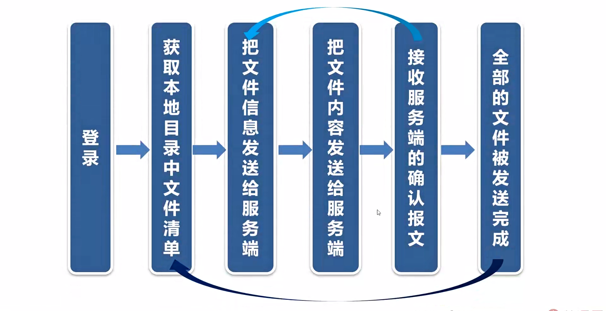

之前开发的基于FTP协议的文件传输系统。主要用于系统之间进行数据交换，FTP协议很简单，但是效率不高，基于TCP协议的文件传输系统。主要用于系统内部进行数据交换，代码写起来麻烦一些，但是传输文件的效率特别高，功能也更强大。

基于TCP协议的文件传输系统
===

- 可实现文件的上传和下载功能
- 采用异步通信机制，实现文件的快速传输

有三个模块

- 一是文件传输的服务端模块(支持上传和下载)
- 二是文件上传的客户端模块
- 三是文件下载的客户端模块

服务端模块只有一个，同时支持文件的上传和下载，客服端模块有两个，一个上传，一个下载。把它分成两个的原因是为了让程序的结构更简单，你可能会问为什么不把服务端也分开成两个模块？让程序结构更简单，原因是这样的服务端，它是网络服务程序，两个网络服务程序。它就需要两个监听的端口，这样的话配置网络参数会更麻烦，比如说路由器要开通两个端口。防火墙也要开通，两个端口 或者你再想一下FTP，我们采用FTP传输文件的时候。FTP的服务端只有一个，既支持文件的上传，也支持下载，但是我们的客户端程序有两个，一个上传，一个下载。如果你一定要把那两个客户端程序合成一个，也是可以的，但是程序的结构会更复杂。

文件上传客户端模块的流程图
---

首先客户端登录，登录的意义并不是判断用户名和密码。而是与服务端协商文件传输的参数。最重要的参数是文件存放的目录，比如说客户端的文件存放在aaa目录，传到服务端之后。存放到bbb目录 第二步，客户端获取本地目录中文件的清单，假设一共有100个文件。接下来用一个循环循环，包括这三个步骤，把100个文件中某一个文件的信息发送给服务端。包括文件名，文件时间，文件大小，然后再把这个文件的内容发送给服务端，服务端成功接受文件之后。再向客户端回应确认报文，客户端收到确认报文之后，这个文件就算上传成功了，然后再回到循环。把下一个文件上传给服务端，这样一直循环下去，直到100个文件全部上传成功。全部的文件上传成功之后，客户端程序可以休息几秒再获取本地目录中文件的清单。再把文件上传给服务端，一直这种循环下去，

有两个细节要注意，一是TCP协议的文件传输系统。用于系统内部对文件传输的时效要求很高，不能延迟太长时间，所以客户端程序一直运行在内存中。不会退出，传完一批文件之后sleep几秒，接着马上传下一批，

还有客户端不需要增量，上传的功能。文件上传成功之后，删除本地文件或者转存到备份目录都可以，为什么不需要增量？上传的功能呢？原因是我们内部的系统。为了保证效率，文件上传成功后就删掉它。这种处理方法最简单，效率也最高。如果需要把文件上传到多个服务端。怎么办呢？解决问题的方法很简单，生成文件的时候拷贝多几份，存到多个目录就可以了，