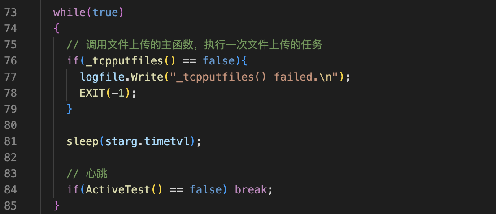
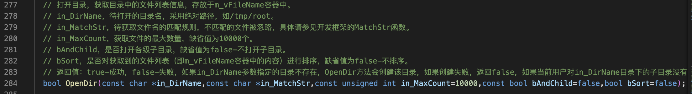
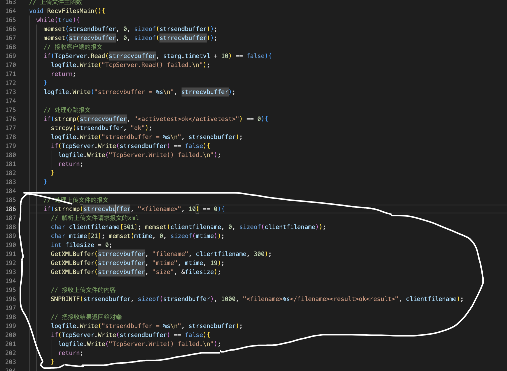

这节课把需要上传的文件名，文件时间，文件大小这些信息告诉服务端，然后再得到服务端的确认

过程
===

客户端
---

登陆完成后进入一个无限的循环，在循环里面执行文件传输的任务



执行一次文件上传的任务

- 调用OpenDir()打开starg.clientpath目录



- 进入目录循环，遍历目录中的每个文件，调用ReadDir(获取文件名)
- 把文件名、修改时间、文件大小组成报文，发送给对端
- 接受对端的确认报文
- 删除或者转存本地的文件

服务端
---

需要写的代码在上传文件的主函数中，先判断报文是不是上传文件的请求，如果是上传文件报文的开始一定有**<filename>**这个字段   首先解析上传文件，请求报文的XML。然后再接收上传文件的内容，接收完了之后再把结果返回给客户端。先解析XML定义几个变量文件名。文件时间，文件大小。变量初始化再解析XML。然后是接收对端发过来的文件内容，这个代码也先不写。直接认为接收文件成功。然后把接收结果返回给客户端。



```c++
/*
 * 程序名：fileserver.cpp，文件传输的服务端
 * 作者：gmc
*/
#include "_public.h"

CLogFile logfile; // 服务程序的运行日志
CTcpServer TcpServer; // 创建服务端对象

// 程序运行的参数结构体
struct st_arg{
  int clienttype; // 客户端类型，1-上传文件；2-下载文件。
  char ip[31]; // 客户端的IP地址
  int port; // 客户端的端口
  int ptype; // 文件上传成功后文件的处理方式1-删除文件，2-移动到备份目录
  char clientpath[301]; // 本地文件存放的根目录
  char clientpathbak[301]; // 文件成功上传后，本地文件备份的根目录，当ptype==2时有效
  bool andchild; // 是否上传clientpath目录下各级子目录的文件，true-是；false-否
  char matchname[301]; // 待上传文件名的匹配方式，如"*.txt,*.XML",注意大写
  char srvpath[301]; // 服务端文件存放的根目录
  int timetvl; // 扫描本地目录的时间间隔，单位秒
  int timeout; // 进程心跳的超时时间
  char pname[51]; // 进程名，用"tcpgetfiles_后缀"的方式
}starg;

void FathEXIT(int sig); // 父进程退出函数
void ChldEXIT(int sig); // 子进程退出函数

char strrecvbuffer[1024]; // 发送报文的buffer
char strsendbuffer[1024]; // 接收报文的buffer

bool srv000(const char* strrecvbuffer, char* strsendbuffer);// 心跳
// 登录业务处理函数
bool ClientLogin();

// 上传文件主函数
void RecvFilesMain();

// 把xml解析到参数starg结构中
bool _xmltoarg(char *strxmlbuffer);

int main(int argc,char *argv[])
{
  if (argc!=3)
  {
    printf("Using:./fileserver port logfile\nExample:./fileserver2 5005 /log/idc/fileserver.log\n\n"); return -1;
  }

  CloseIOAndSignal();
  signal(SIGINT, FathEXIT); signal(SIGTERM, FathEXIT);
  
  if(logfile.Open(argv[2], "a+") == false){
    printf("logfile.Open(%s) failed\n", argv[2]);
    return -1;
  }

  // 服务端初始化
  if(TcpServer.InitServer(atoi(argv[1])) == false){
    logfile.Write("TcpServer.InitServer(%s) failed.\n", argv[1]);
    return -1;
  }
  
  while(true){
    // 等待客户端的连接
    if(TcpServer.Accept() == false){
      logfile.Write("TcpServer.Accept() failed.\n");
      FathEXIT(-1);
      // return -1;
    }

    logfile.Write("客户端（%s）已连接。\n", TcpServer.GetIP());
// printf("listenfd = %d, connfd = %d\n", TcpServer.m_listenfd, TcpServer.m_connfd);

    // if(fork() > 0) { // 父进程继续回到Accept();
    //   TcpServer.CloseClient();
    //   continue;
    // }
    // // 子进程重新设置退出信号。
    // signal(SIGINT, ChldEXIT); signal(SIGTERM, ChldEXIT);

    // TcpServer.CloseListen();
    // 子进程与客户端进行通讯，处理业务

    // 处理登录客户端的登录报文
    if(ClientLogin() == false) ChldEXIT(-1);

    // 如果clienttype == 1 调用上传文件的主函数
    if(starg.clienttype == 1) RecvFilesMain();
    // 与客户端通讯，接收客户端发过来的报文后，回复ok。
    

    ChldEXIT(0);
    // return 0;
  }
}

void FathEXIT(int sig){// 父进程退出函数
// 以下代码是为了防止信号处理函数在执行的过程中被信号中断
  signal(SIGINT, SIG_IGN); signal(SIGTERM, SIG_IGN);
  logfile.Write("父进程退出。sig = %d.\n", sig);
  TcpServer.CloseListen(); // 关闭监听的socket
  kill(0, 15); // 通知全部的子进程退出
  exit(0);
}

void ChldEXIT(int sig){// 子进程退出函数
// 以下代码是为了防止信号处理函数在执行的过程中被信号中断
  signal(SIGINT, SIG_IGN); signal(SIGTERM, SIG_IGN);
  logfile.Write("子进程退出。sig = %d.\n", sig);
  TcpServer.CloseClient(); // 关闭客户端的socket
  exit(0);
}

// 登录
bool ClientLogin(){
  memset(strsendbuffer, 0, sizeof(strsendbuffer));
  memset(strrecvbuffer, 0, sizeof(strrecvbuffer));

  if(TcpServer.Read(strrecvbuffer, 20) == false){
    logfile.Write("TcpServer.Read() failed.\n");
    return false;
  }
  logfile.Write("strrecvbuffer = %s\n", strrecvbuffer);

  // 解析客户端登录报文
  _xmltoarg(strrecvbuffer);

  if((starg.clienttype != 1) && (starg.clienttype != 2))
    strcpy(strsendbuffer, "failed");
  else
    strcpy(strsendbuffer, "ok");

  if(TcpServer.Write(strsendbuffer) == false){
    logfile.Write("TcpServer.Write() failed.\n");
    return false;
  }
  logfile.Write("%s login %s\n", TcpServer.GetIP(), strsendbuffer);
  return true;
}

bool _xmltoarg(char* strxmlbuffer){
  memset(&starg, 0, sizeof(struct st_arg));

  GetXMLBuffer(strxmlbuffer, "clienttype", &starg.clienttype);
  GetXMLBuffer(strxmlbuffer, "ptype", &starg.ptype);
  GetXMLBuffer(strxmlbuffer, "clientpath", starg.clientpath);
  GetXMLBuffer(strxmlbuffer, "andchild", &starg.andchild);
  GetXMLBuffer(strxmlbuffer, "matchname", starg.matchname);
  GetXMLBuffer(strxmlbuffer, "srvpath", starg.srvpath);

  GetXMLBuffer(strxmlbuffer, "timetvl", &starg.timetvl);
  if(starg.timetvl > 30) starg.timetvl = 30; // 扫描本地文件的时间间隔，没有必要超过30秒

  GetXMLBuffer(strxmlbuffer, "timeout", &starg.timeout);
  if(starg.timeout < 50) starg.timeout = 50;// 进程心跳的超时时间，没有必要小于50秒

  GetXMLBuffer(strxmlbuffer, "pname", starg.pname);
  strcat(starg.pname, "_srv");

  return true;
}

// 上传文件主函数
void RecvFilesMain(){
  while(true){
    memset(strsendbuffer, 0, sizeof(strsendbuffer));
    memset(strrecvbuffer, 0, sizeof(strrecvbuffer));
    // 接收客户端的报文
    if(TcpServer.Read(strrecvbuffer, starg.timetvl + 10) == false){
      logfile.Write("TcpServer.Read() failed.\n");
      return;
    }
    logfile.Write("strrecvbuffer = %s\n", strrecvbuffer);

    // 处理心跳报文
    if(strcmp(strrecvbuffer, "<activetest>ok</activetest>") == 0){
      strcpy(strsendbuffer, "ok");
      logfile.Write("strsendbuffer = %s\n", strsendbuffer);
      if(TcpServer.Write(strsendbuffer) == false){
        logfile.Write("TcpServer.Write() failed.\n");
        return;
      }
    }

    // 处理上传文件的报文
    if(strncmp(strrecvbuffer, "<filename>", 10) == 0){
      // 解析上传文件请求报文的xml
      char clientfilename[301]; memset(clientfilename, 0, sizeof(clientfilename));
      char mtime[21]; memset(mtime, 0, sizeof(mtime));
      int filesize = 0;
      GetXMLBuffer(strrecvbuffer, "filename", clientfilename, 300);
      GetXMLBuffer(strrecvbuffer, "mtime", mtime, 19);
      GetXMLBuffer(strrecvbuffer, "size", &filesize);

      // 接收上传文件的内容
      SNPRINTF(strsendbuffer, sizeof(strsendbuffer), 1000, "<filename>%s</filename><result>ok<result>", clientfilename);

      // 把接收结果返回给对端
      logfile.Write("strsendbuffer = %s\n", strsendbuffer);
      if(TcpServer.Write(strsendbuffer) == false){
        logfile.Write("TcpServer.Write() failed.\n");
        return;
      }

    }
  }
}
```

